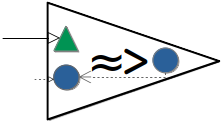
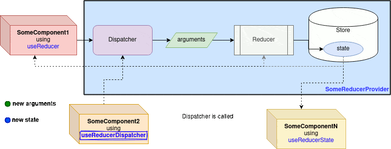
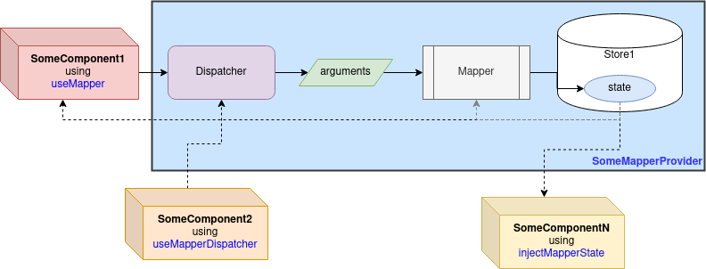
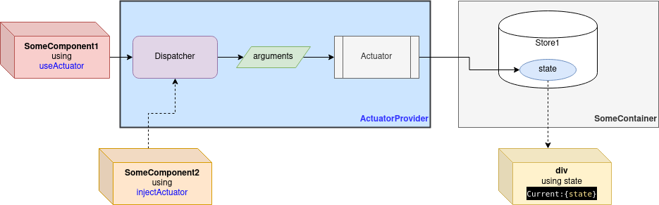

<p align="center">
  <a href="https://react-reducer-provider.github.io/"></a>
</p>

<h1 align="center">Asynchronous/Synchronous React Centralized State</h1>
<h2 align="center">with Hooks and HOC</h2>

<p align="center">through Centralized <b><a hef="https://react-reducer-provider.github.io/docs/using-reducer.html">Reducers</a>/<a hef="https://react-reducer-provider.github.io/docs/using-mapper.html">Mappers</a>/<a hef="https://react-reducer-provider.github.io/docs/using-actuator.html">Actuators</a></b></p>
<p align="center">Flux/Redux made <b>Easy, Simple</b> and Beyond</p>

[](https://react-reducer-provider.github.io/)
[](https://www.npmjs.com/package/react-reducer-provider)
[](https://www.npmjs.com/package/react-reducer-provider)
[](https://bundlephobia.com/result?p=react-reducer-provider)
[](https://bundlephobia.com/result?p=react-reducer-provider)
[](https://bundlephobia.com/result?p=react-reducer-provider)
[](https://react-reducer-provider.github.io/docs/typings.html)
[](https://react-reducer-provider.github.io/LICENSE.txt)
[](https://gmullerb.gitlab.io/react-reducer-provider/tests/tests_report.html)
[](https://gmullerb.gitlab.io/react-reducer-provider/coverage/index.html)
[](https://github.com/gmullerb/react-reducer-provider)
[](https://gitlab.com/gmullerb/react-reducer-provider)

__________________

**`react-reducer-provider` provides a centralized state, managed asynchronously or synchronously through a reducer, mapper or actuator.**

__________________

## Quick Start

1 . Add dependency:

`package.json`:

when using hooks:

```json
  ..
  "dependencies": {
    "react": ">=16.8.0"
    "react-reducer-provider": "5.1.0",
    ..
```

when using HOC:

```json
  ..
  "dependencies": {
    "react": ">=16.0.0"
    "react-reducer-provider": "5.1.0",
    ..
```

### [Reducers](https://react-reducer-provider.github.io/docs/using-reducer.html)

2 . Create the **[`AsyncReducerProvider`](https://react-reducer-provider.github.io/docs/using-reducer.html#asyncreducerprovider)** or **[`SyncReducerProvider`](https://react-reducer-provider.github.io/docs/using-reducer.html#syncreducerprovider)** component to manage the centralized state:


a . Define the initial state.  
b . Define the reducer function.  
c . Define the Reducer Provider.

**`SomeReducerProvider.jsx`**:

```jsx
import React from 'react'
import { SyncReducerProvider } from 'react-reducer-provider'

const initialState = 0

function reduce(prevState, action, delta) {
  switch (action) {
    case 'ACTION1':
      return prevState + delta
    case 'ACTION2':
      return prevState - delta
    default:
      return prevState
  }
}

function SomeReducerProvider({ children }) {
  return (
    <SyncReducerProvider
      reducer={reduce}
      initialState={initialState}
    >
      {children}
    </SyncReducerProvider>
  )
}

export default SomeReducerProvider
```

3 . Access the state and the dispatcher of the Provider component using the hooks or HOC provided by `'react-reducer-provider'`:

* **[`useReducer`](https://react-reducer-provider.github.io/docs/using-reducer.html#usereducer)/[`injectReducer`](https://react-reducer-provider.github.io/docs/using-reducer.html#injectreducer)**.
* **[`useReducerDispatcher`](https://react-reducer-provider.github.io/docs/using-reducer.html#usereducerdispatcher)/[`injectReducerDispatcher`](https://react-reducer-provider.github.io/docs/using-reducer.html#injectreducerdispatcher)**.
* **[`useReducerState`](https://react-reducer-provider.github.io/docs/using-reducer.html#usereducerstate)/[`injectReducerState`](https://react-reducer-provider.github.io/docs/using-reducer.html#injectreducerstate)**.


`SomeComponent1.jsx` => using `useReducer`:

```jsx
import { useReducer } from 'react-reducer-provider'
import React from 'react'

export default function SomeComponent1() {
  const { state, dispatch } = useReducer()
  return (
    <button onClick={() => dispatch('ACTION1', 2)}>
      Go up (from {state})!
    </button>
  )
}
```

`SomeComponent2.jsx` => using `injectReducerDispatcher`:

```jsx
import { injectReducerDispatcher } from "react-reducer-provider";
import React from "react";

class SomeComponent2 extends React.Component {
  render() {
    return (
      <button onClick={() => {
        const newState = dispatch('ACTION2', 1)
        console.info(newState)
      }}>
        Go down!
      </button>
    )
  }
}

export default injectReducerDispatcher(SomeComponent2, 'dispatch')
```

`SomeComponentN.jsx` => using `useReducerState`:

```jsx
import { useReducerState } from 'react-reducer-provider'
import React from 'react'

export default function SomeComponentN() {
  const currentState = useReducerState()
  return (
    <div>
      Current:{currentState}
    </div>
  )
}
```

4 . Wrap components which will consume the `SomeReducerProvider` component:

`SomeContainer.jsx`:

```jsx
import SomeComponent1 from './path/to/SomeComponent1'
import SomeComponent2 from './path/to/SomeComponent2'
import SomeComponentN from './path/to/SomeComponentN'
import SomeReducerProvider from '../path/to/SomeReducerProvider'
import React from 'react'

export default function SomeContainer() {
  return (
    <SomeReducerProvider>
      <SomeComponent1/>
      <SomeComponent2/>
      <SomeComponentN/>
    </SomeReducerProvider>
  )
}
```



> This `SyncReducerProvider` example can be checked on line at [gmullerb-react-reducer-provider codesandbox](https://codesandbox.io/s/gmullerb-react-reducer-provider-forked-pjkve?file=/src/SomeReducerProvider.jsx):
[](https://codesandbox.io/s/gmullerb-react-reducer-provider-forked-pjkve?file=/src/SomeReducerProvider.jsx)  
> This `SyncReducerProvider`with HOC example can be checked on line at [gmullerb-react-reducer-provider codesandbox](https://codesandbox.io/s/gmullerb-react-reducer-provider-forked-lj4si?file=/src/SomeReducerProvider.jsx):  
[](https://codesandbox.io/s/gmullerb-react-reducer-provider-forked-lj4si?file=/src/SomeReducerProvider.jsx)  
> An `AsyncReducerProvider` example can be checked on line at [gmullerb-react-reducer-provider-async codesandbox](https://codesandbox.io/s/gmullerb-react-reducer-provider-async-forked-cyl3g?file=/src/SomeReducerProvider.jsx):  
[](https://codesandbox.io/s/gmullerb-react-reducer-provider-async-forked-cyl3g?file=/src/SomeReducerProvider.jsx)  
> Examples of use can be looked at [basecode-react-ts](https://github.com/gmullerb/basecode-react-ts) and [test files](https://github.com/gmullerb/react-reducer-provider/blob/HEAD/tests/js).  

### [Mappers](https://react-reducer-provider.github.io/docs/using-mapper.html)

2 . Create the **[`AsyncMapperProvider`](https://react-reducer-provider.github.io/docs/using-mapper.html#asyncmapperprovider)** or **[`SyncMapperProvider`](https://react-reducer-provider.github.io/docs/using-mapper.html#syncmapperprovider)** component to manage the centralized state:


a . Define the initial state.  
b . Define the mapper function.  
c . Define the Mapper Provider.

**`SomeMapperProvider.jsx`**:

```jsx
import React from "react";
import { SyncMapperProvider } from "react-reducer-provider";

const initialState = 0;

function map(action) {
  switch (action) {
    case "ACTION1":
      return 1;
    case "ACTION2":
      return -1;
    default:
      return 0;
  }
}

function SomeMapperProvider({ children }) {
  return (
    <SyncMapperProvider
      id="someNamedMapper"
      mapper={map}
      initialState={initialState}
    >
      {children}
    </SyncMapperProvider>
  );
}

export { SomeMapperProvider };
```

3 . Access the state and the dispatcher of the Provider component using the hooks or HOC provided by `'react-reducer-provider'`:

* **[`useMapper`](https://react-reducer-provider.github.io/docs/using-mapper.html#usemapper)/[`injectMapper`](https://react-reducer-provider.github.io/docs/using-mapper.html#injectmapper)**.
* **[`useMapperDispatcher`](https://react-reducer-provider.github.io/docs/using-mapper.html#usemapperdispatcher)/[`injectMapperDispatcher`](https://react-reducer-provider.github.io/docs/using-mapper.html#injectmapperdispatcher)**.
* **[`useMapperState`](https://react-reducer-provider.github.io/docs/using-mapper.html#usemapperstate)/[`injectMapperState`](https://react-reducer-provider.github.io/docs/using-mapper.html#injectmapperstate)**.


`SomeComponent1.jsx` => using `useMapper`:

```jsx
import { useMapper } from "react-reducer-provider";
import React from "react";

export default function SomeComponent1() {
  const [state, dispatch] = useMapper("someNamedMapper");
  return (
    <button onClick={() => dispatch("ACTION1")}>
      Set to 1 (from {state})!
    </button>
  );
}
```

`SomeComponent2.jsx` => using `useMapperDispatcher`:

```jsx
import { useMapperDispatcher } from "react-reducer-provider";
import React from "react";

export default function SomeComponent2() {
  const dispatch = useMapperDispatcher("someNamedMapper");
  return <button onClick={() => dispatch("ACTION2")}>Set to -1!</button>;
}
```

`SomeComponentN.jsx` => using `injectMapperState`:

```jsx
import { injectMapperState } from "react-reducer-provider";
import React from "react";

class SomeComponentN extends React.Component {
  render() {
    return <div>Current:{this.props.currentState}</div>;
  }
}

export default injectMapperState(SomeComponentN, 'currentState')
```

4 . Wrap components which will consume the `SomeMapperProvider` component:

`SomeContainer.jsx`:

```jsx
import SomeComponent1 from "./SomeComponent1";
import SomeComponent2 from "./SomeComponent2";
import SomeComponentN from "./SomeComponentN";
import { SomeMapperProvider } from "./SomeMapperProvider";
import React from "react";

export default function SomeContainer() {
  return (
    <SomeMapperProvider>
      <SomeComponent1 />
      <SomeComponent2 />
      <SomeComponentN />
    </SomeMapperProvider>
  );
}
```



> An `SyncMapperProvider` example can be checked on line at [gmullerb-react-mapper-provider codesandbox](https://codesandbox.io/s/gmullerb-react-mapper-provider-yvwx7?file=/src/SomeMapperProvider.jsx):  
[](https://codesandbox.io/s/gmullerb-react-mapper-provider-yvwx7?file=/src/SomeMapperProvider.jsx)  
> An `AsyncMapperProvider` example can be checked on line at [gmullerb-react-mapper-provider-async codesandbox](https://codesandbox.io/s/gmullerb-react-mapper-provider-async-forked-d2foz?file=/src/SomeMapperProvider.jsx):  
[](https://codesandbox.io/s/gmullerb-react-mapper-provider-async-forked-d2foz?file=/src/SomeMapperProvider.jsx)  
> Examples of use can be looked at [test files](https://github.com/gmullerb/react-reducer-provider/blob/HEAD/tests/js).  

### [Actuators](https://react-reducer-provider.github.io/docs/using-actuator.html)

2 . Create the **[`ActuatorProvider`](https://react-reducer-provider.github.io/docs/using-actuator.html#actuatorprovider)** component to manage a state (or whatever you need, not only state):


a . Define actuator function.  
b . Define Actuator Provider.  
c. Wrap components which will consume the `ActuatorProvider`:

`SomeContainer.jsx`:

```jsx
import SomeComponent1 from './path/to/SomeComponent1'
import SomeComponent2 from './path/to/SomeComponent2'
import { ActuatorProvider } from 'react-reducer-provider'
import React from 'react'

export function SomeContainer() {
  const [state, setState] = React.useState(0)
  const actuate = delta => setState(state + delta)
  return (
    <div>
      <ActuatorProvider actuator={actuate}>
        <SomeComponent1/>
        <SomeComponent2/>
      </ActuatorProvider>
      <div>
        Current:{state}
      </div>
    </div>
  )
}
```

3 . Access dispatcher of the Provider component using the hooks or HOC provided by `'react-reducer-provider'`:

* **[`useActuator`](https://react-reducer-provider.github.io/docs/using-actuator.html#useactuator)/[`injectActuator`](https://react-reducer-provider.github.io/docs/using-actuator.html#injectactuator)**.


`SomeComponent1.jsx` => using `useActuator`:

```jsx
import { useActuator } from 'react-reducer-provider'
import React from 'react'

export function SomeComponent1() {
  const dispatch = useActuator()
  return (
    <button onClick={() => dispatch(+1)}>
      Go up!
    </button>
  )
}
```

`SomeComponent2.jsx` => using `injectActuator`:

```jsx
import { injectActuator } from "react-reducer-provider";
import React from "react";

class SomeComponent2 extends React.Component {
  render() {
    return (
      <button
        onClick={() => {
          const newState = this.props.dispatch(-1);
          console.info(newState);
        }}
      >
        Go down!
      </button>
    );
  }
}

export default injectActuator(SomeComponent2, "dispatch");
```



> This `ActuatorProvider` example can be checked on line at [gmullerb-react-actuator-provider codesandbox](https://codesandbox.io/s/gmullerb-react-actuator-provider-5sl0o?file=/src/SomeContainer.jsx):  
[](https://codesandbox.io/s/gmullerb-react-actuator-provider-5sl0o?file=/src/SomeContainer.jsx)  
> Examples of use can be looked at [test files](https://github.com/gmullerb/react-reducer-provider/blob/HEAD/tests/js).  

__________________

## Goal

With the introduction of React Hooks, in some way using Flux **library**[1] was deprecated, `react-reducer-provider` looks to **give a quick and easy alternative using hooks to implement Flux with reducers**.

* Provides Reducers, but also **Mappers** and **Actuators**.
* It allows to use [**Asynchronous** Reducer/Mapper/Dispatcher](https://react-reducer-provider.github.io/docs/reference-definition.html#asyncreducerprovider).
* [Reducer/Mapper/Dispatcher can have **more parameters/arguments** than traditional reducer which have only (state, action)](https://react-reducer-provider.github.io/docs/reference-definition.html#extraparameters).
* [Dispatcher **returns the new State or a Promise of the new State**](https://react-reducer-provider.github.io/docs/reference-definition.html#dispatcher).
* **Actuator** allows you to easily introduced centralized state without moving your existing state, i.e. allows you to avoid using a new state container if you already have one.
* [Each Reducer/Mapper/Actuators Provider can have a **different names, numbers or symbols which allows for easy identification and nesting**](https://react-reducer-provider.github.io/docs/nesting.html).
* Provides and Easy way of combining reducer/mapper/actuator functions. through Tags. [2].
* **Smaller** than other packages with "same" functionality, and no dependencies [3].
* It is ready for **Tree Shaking optimization**, so you get only what you need from the `react-reducer-provider` in the final app bundle [3].
* It provides [its own **type definitions for Typescript and Flow**](https://react-reducer-provider.github.io/docs/typings.html).
* **Full Tested**, not only focus in coverage, but also in cases and typings: [tests](https://github.com/gmullerb/react-reducer-provider/blob/HEAD/tests/js), [results](https://gmullerb.gitlab.io/react-reducer-provider/tests/tests_report.html), [coverage](https://gmullerb.gitlab.io/react-reducer-provider/coverage/index.html) and [typings tests](https://github.com/gmullerb/react-reducer-provider/blob/HEAD/tests/typings).

> [1] Not the Flux architecture.  
> [2] react-redux makes it too complicated.  
> [3] Check and Compare with other solutions at [bundlephobia.com](https://bundlephobia.com/result?p=react-reducer-provider).  
> `react-reducer-provider` is the evolution of [react-named-reducer](https://www.npmjs.com/package/react-named-reducer) (which is a derivation of [react-reducer-context](https://www.npmjs.com/package/react-reducer-context)).

__________________

**You define**:


**or**


**or**


__________________

**and then you use them through a**:


__________________

## Prerequisites

**At least [`"react": ">=16.0.0"`]** - [React Context](https://reactjs.org/docs/context.html) => when using HOC, i.e. [`injectReducer` · `injectReducerState` · `injectReducerDispatcher` · `injectMapper` · `injectMapperState` · `injectMapperDispatcher`](https://react-reducer-provider.github.io/docs/reference-consumption-hoc.html) or [`injectTaggedAny` · `injectTaggedReducer` · `injectTaggedReducerState` · `injectTaggedReducerDispatcher` · `injectTaggedMapper` · `injectTaggedMapperState` · `injectTaggedMapperDispatcher`](https://react-reducer-provider.github.io/docs/tagged-consumption-hoc.html).

**[`"react": ">=16.8.0"`]** - [React Hooks](https://reactjs.org/docs/hooks-overview.html) => when using hooks, i.e. [`useReducer` · `useReducerState` · `useReducerDispatcher` · `useMapper` · `useMapperState` · `useMapperDispatcher`](https://react-reducer-provider.github.io/docs/reference-consumption-hooks.html) or [`useTaggedAny` · `useTaggedReducer` · `useTaggedReducerState` · `useTaggedReducerDispatcher` · `useTaggedMapper` · `useTaggedMapperState` · `useTaggedMapperDispatcher`](https://react-reducer-provider.github.io/docs/tagged-consumption-hooks.html).

>`react-reducer-provider` only enforces `"react": ">=16.0.0"` in `package.json` is up to you to be set which version you need.

__________________

## Documentation

* [Reducers](https://react-reducer-provider.github.io/docs/using-reducer.html)
  * [`AsyncReducerProvider`](https://react-reducer-provider.github.io/docs/using-reducer.html#asyncreducerprovider).
  * [`SyncReducerProvider`](https://react-reducer-provider.github.io/docs/using-reducer.html#syncreducerprovider).
  * Hooks:
    * [`useReducer`](https://react-reducer-provider.github.io/docs/using-reducer.html#usereducer).
    * [`useReducerDispatcher`](https://react-reducer-provider.github.io/docs/using-reducer.html#usereducerdispatcher).
    * [`useReducerState`](https://react-reducer-provider.github.io/docs/using-reducer.html#usereducerstate).
  * HOC:
    * [`injectReducer`](https://react-reducer-provider.github.io/docs/using-reducer.html#injectreducer).
    * [`injectReducerDispatcher`](https://react-reducer-provider.github.io/docs/using-reducer.html#injectreducerdispatcher).
    * [`injectReducerState`](https://react-reducer-provider.github.io/docs/using-reducer.html#injectreducerstate).

* [Mappers](https://react-reducer-provider.github.io/docs/using-mapper.html).
  * [`AsyncMapperProvider`](https://react-reducer-provider.github.io/docs/using-mapper.html#asyncmapperprovider).
  * [`SyncMapperProvider`](https://react-reducer-provider.github.io/docs/using-mapper.html#syncmapperprovider).
  * Hooks:
    * [`useMapper`](https://react-reducer-provider.github.io/docs/using-mapper.html#usemapper).
    * [`useMapperDispatcher`](https://react-reducer-provider.github.io/docs/using-mapper.html#usemapperdispatcher).
    * [`useMapperState`](https://react-reducer-provider.github.io/docs/using-mapper.html#usemapperstate).
  * HOC:
    * [`injectMapper`](https://react-reducer-provider.github.io/docs/using-mapper.html#injectmapper).
    * [`injectMapperDispatcher`](https://react-reducer-provider.github.io/docs/using-mapper.html#injectmapperdispatcher).
    * [`injectMapperState`](https://react-reducer-provider.github.io/docs/using-mapper.html#injectmapperstate).
* [Actuators](https://react-reducer-provider.github.io/docs/using-actuator.html).
  * [`ActuatorProvider`](https://react-reducer-provider.github.io/docs/using-actuator.html#actuatorprovider).
  * Hooks:
    * [`useActuator`](https://react-reducer-provider.github.io/docs/using-actuator.html#useactuator).
  * HOC:
    * [`injectActuator`](https://react-reducer-provider.github.io/docs/using-actuator.html#injectactuator).
* [Singleton](https://react-reducer-provider.github.io/docs/singleton.html).
* [Nesting Providers](https://react-reducer-provider.github.io/docs/nesting.html).
* Combining/Blending - Tagged Reducers/Mappers/Actuator.
  * [`AsyncTaggedReducerProvider` · `SyncTaggedReducerProvider` · `AsyncTaggedMapperProvider` · `SyncTaggedMapperProvider` · `TaggedActuatorProvider`](https://react-reducer-provider.github.io/docs/tagged-definition.html).
  * [`useTaggedAny` · `useTaggedReducer` · `useTaggedReducerState` · `useTaggedReducerDispatcher` · `useTaggedMapper` · `useTaggedMapperState` · `useTaggedMapperDispatcher` · `useTaggedActuator`](https://react-reducer-provider.github.io/docs/tagged-consumption-hooks.html).
  * [`injectTaggedAny` · `injectTaggedReducer` · `injectTaggedReducerState` · `injectTaggedReducerDispatcher` · `injectTaggedMapper` · `injectTaggedMapperState` · `injectTaggedMapperDispatcher` · `injectTaggedActuator`](https://react-reducer-provider.github.io/docs/tagged-consumption-hoc.html).
* [Typings](https://react-reducer-provider.github.io/docs/typings.html).
* Extras:
  * [With Injection](https://react-reducer-provider.github.io/docs/with-injection.html).
    * [with Flow typings](https://react-reducer-provider.github.io/docs/with-injection-and-flow-typings.html).
    * [with Typescript typings](https://react-reducer-provider.github.io/docs/with-injection-and-ts-typings.html).
  * [With Actions Creators](https://react-reducer-provider.github.io/docs/with-actions-creators.html).
    * [with Flow typings](https://react-reducer-provider.github.io/docs/with-actions-creators-and-flow-typings.html).
    * [with Typescript typings](https://react-reducer-provider.github.io/docs/with-actions-creators-and-ts-typings.html).
  * [Testing](https://react-reducer-provider.github.io/docs/testing.html).
  * Examples:
    * **[Online examples](https://react-reducer-provider.github.io/docs/online.html)**.
    * [Examples from tests](https://github.com/gmullerb/react-reducer-provider/blob/HEAD/tests/js).
    * [Typings' examples from tests](https://github.com/gmullerb/react-reducer-provider/blob/HEAD/tests/typings).
  * [Migration](https://react-reducer-provider.github.io/docs/migration.html).
  * [Extending/Developing](https://react-reducer-provider.github.io/docs/developing.html).

* [`CHANGELOG`](https://react-reducer-provider.github.io/docs/CHANGELOG.html): add information of notable changes for each version here, chronologically ordered ([Keep a Changelog](http://keepachangelog.com)).

## Contributing

* **Use it**.
* **Share it**.
* [Give it a Star](https://github.com/gmullerb/react-reducer-provider).
* [Propose changes or improvements](https://github.com/gmullerb/react-reducer-provider/issues).
* [Report bugs](https://github.com/gmullerb/react-reducer-provider/issues).

## License

[MIT License](https://react-reducer-provider.github.io/LICENSE.txt)

__________________

## Remember

* Use code style verification tools => Encourages Best Practices, Efficiency, Readability and Learnability.
* Code Review everything => Encourages Functional suitability, Performance Efficiency and Teamwork.
* If viable, Start testing early => Encourages Reliability and Maintainability.

## Additional words

Don't forget:

* **Love what you do**.
* **Learn everyday**.
* **Learn yourself**.
* **Share your knowledge**.
* **Think different!**.
* **Learn from the past, dream on the future, live and enjoy the present to the max!**.
* **Enjoy and Value the Quest** (It's where you learn and grow).

At life:

* Let's act, not complain.
* Be flexible.

At work:

* Let's give solutions, not questions.
* Aim to simplicity not intellectualism.
