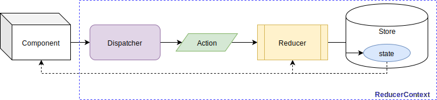
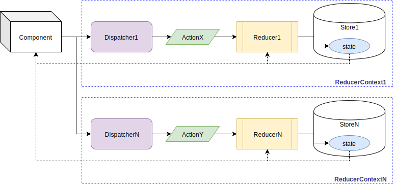

<p align="center">
  
</p>

<h1 align="center">React Component to manage State through reducers using contexts and hooks</h1>

<p align="center">with typings for Typescript and Flow</p>

__________________

[](LICENSE.txt)   [](https://www.npmjs.com/package/react-reducer-context)

This project is licensed under the terms of the [MIT license](LICENSE.txt).
__________________

## Quick Start

1 . Add dependency:

`package.json`:

```json
  ..
  "dependencies": {
    "react": "^16.8.0"
    "react-reducer-context": "1.0.2",
    ..
```

2 . Create the **`ReducerContext`** component to manage state:

* Define the initial state.
* Define the reducer function.
* Define the `ReducerContext`.

**`SomeReducerContext.jsx`**:

```jsx
import React, { createContext } from 'react'
import ReducerContext from 'react-reducer-context'

const initialState = 0

function reduce(prevState, action) {
  switch (action) {
    case 'ACTION1':
      return prevState + 1
    case 'ACTION2':
      return prevState - 1
    default:
      return prevState
  }
}

const someReducerContext = createContext(null)

function SomeReducerContext({ children }) {
  return (
    <ReducerContext
      context={someReducerContext}
      reducer={reduce}
      initialState={initialState}
    >
      {children}
    </ReducerContext>
  )
}

export {
  someReducerContext as default,
  SomeReducerContext
}
```

3 . Wrap components which needs the `ReducerContext` component:

`SomeContainer.jsx`:

```jsx
import SomeComponent1 from './path/to/SomeComponent1'
import SomeComponent2 from './path/to/SomeComponent2'
import SomeComponentN from './path/to/SomeComponentN'
import { SomeReducerContext } from '../path/to/SomeReducerContext'
import React from 'react'

export default function SomeContainer() {
  return (
    <SomeReducerContext>
      <SomeComponent1/>
      <SomeComponent2/>
      <SomeComponentN/>
    </SomeReducerContext>
  )
}
```

4 . Access the `ReducerContext` component using `'react-reducer-context'` hooks:

* **`useReducerContext`**.
* **`useReducerDispatcher`**.
* **`useReducerState`**.

`SomeComponent1.jsx` [1]:

```jsx
import someReducerContext from '../path/to/SomeReducerContext'
import { useReducerContext } from 'react-reducer-context'
import React from 'react'

export default function SomeComponent1() {
  const { state, dispatch } = useReducerContext(someReducerContext)
  return (
    <button onClick={() => dispatch('ACTION1')}>
      Go up (from {state})!
    </button>
  )
}
```

`SomeComponent2.jsx` [1]:

```jsx
import someReducerContext from '../path/to/SomeReducerContext'
import { useReducerDispatcher } from 'react-reducer-context'
import React from 'react'

export default function SomeComponent2() {
  const dispatch = useReducerDispatcher(someReducerContext)
  return (
    <button onClick={() => dispatch('ACTION2')}>
      Go down!
    </button>
  )
}
```

`SomeComponentN.jsx` [1]:

```jsx
import someReducerContext from '../path/to/SomeReducerContext'
import { useReducerState } from 'react-reducer-context'
import React from 'react'

export default function SomeComponentN() {
  const currentState = useReducerState(someReducerContext)
  return (
    <div>
      Current:{currentState}
    </div>
  )
}
```

> This example can be checked on line: live at [gmullerb-react-reducer-context demo](https://57esd.csb.app/) and the code is at [gmullerb-react-reducer-context codesandbox](https://codesandbox.io/s/gmullerb-react-reducer-context-57esd?module=%2Fsrc%2FSomeReducerContext.jsx):  
[](https://codesandbox.io/s/gmullerb-react-reducer-context-57esd?module=%2Fsrc%2FSomeReducerContext.jsx)  
> [1] Injection can be used in order to improve design, but in favor of quick example this was surrender, look at [Injection](readme/with-injection.md) for injection example.  

3 . Jump based on requirements into:  

* [`ReducerContext` | `useReducerContext` | `useReducerState` | `useReducerDispatcher`](#reference).
  * [Nesting](#nesting).
  * [Typings](#typings).
  * [Prerequisites](#prerequisites).
  * Extras:
    * [With Injection](readme/with-injection.md).
      * [with Flow typings](readme/with-injection-and-flow-typings.md).
      * [with Typescript typings](readme/with-injection-and-ts-typings.md).
    * [With Actions Creators](readme/with-actions-creators.md)
      * [with Flow typings](readme/with-actions-creators-and-flow-typings.md)
      * [with Typescript typings](readme/with-actions-creators-and-ts-typings.md)
* [Extending/Developing](readme/developing.md)
* [MIT License](LICENSE.txt)

__________________

## Goal

With the introduction of React Hooks, in some way using Flux library[1] was deprecated, react-reducer-context looks to **give a quick and easy alternative using hooks to implement Flux with reducers**, with typings for Typescript and Flow.

> [1] Not the Flux architecture.
__________________

## `ReducerContext` | `useReducerContext` | `useReducerState` | `useReducerDispatcher`

[`ReducerContext`](src/main/js/ReducerContext.js) is a React Component which defines a [React Context](https://reactjs.org/docs/context.html) that allows to Manage State using [Flux](http://facebook.github.io/flux), an application architecture that handles application states in a unidirectional way.

* Flux is composed basically with:
  * Stores: keeps states of the app (or components).
    * Reducer: function that changes the State based on an Action and the previous State.
  * Actions: triggers changes in Store.
  * Dispatcher: sends Actions to the Store.
    * Mainly the bridge between the Store and Components.


[`ReducerContext`](src/main/js/ReducerContext.js) is a React "Special" Element that requires 3 properties:

* `context`: constitutes the [React Context](https://reactjs.org/docs/context.html) which will be handle by this component.
  * use `React.createContext(null)` to create the context.
* `reducer`: a function that will receive the current state and an action to produce a new state.
  * internally use [`useReducer` hook](https://reactjs.org/docs/hooks-reference.html#usereducer), which return the current state and a [dispatcher](http://facebook.github.io/flux/docs/dispatcher).
* `initialState`: inception state for the component.

```jsx
  <ReducerContext
    context={someReducerContext}
    reducer={reduce}
    initialState={initialState}
  >
    {children}
  </ReducerContext>
```

Each `ReducerContext` is equivalent to an Flux stream:



`children` elements will be **able to access the State and Dispatcher**.  
There are different ways of doing this:

A . Using `useReducerContext`:

* `useReducerContext` is a "typings-friendly" version of `useContext` that returns the status and dispatcher.
  * which also increase Readability => increase Maintainability.

```jsx
  const { state, dispatch } = useReducerContext(someReducerContext)
```

e.g.:

```jsx
import someReducerContext from '../path/to/SomeReducerContext'
import { useReducerContext } from 'react-reducer-context'
import React from 'react'

export default function SomeComponent() {
  const { state, dispatch } = useReducerContext(someReducerContext)
  return (
    <button onClick={() => dispatch({
        type: 'SOME_ACTION',
        data: someValue
      })}
    >
      Do something! ({state.someValue})
    </button>
  )
}
```

B . Using `useReducerState`:

* `useReducerState` is a "typings-friendly" function that allows to access only state.
  * which also increase Readability => increase Maintainability.

```jsx
  const state = useReducerState(someReducerContext)
```

e.g.:

```jsx
import someReducerContext from '../path/to/SomeReducerContext'
import { useReducerState } from 'react-reducer-context'
import React from 'react'

export default function SomeComponent() {
  const state = useReducerState(someReducerContext)
  return (
    <div>
      Some Value: ({state.someValue})
    </div>
  )
}
```

C . Using `useReducerDispatcher`:

* `useReducerDispatcher` is a "typings-friendly" function that allows to access only the dispatcher.
  * which also increase Readability => increase Maintainability.

```jsx
  const dispatch = useReducerDispatcher(someReducerContext)
```

e.g.:

```jsx
import someReducerContext from '../path/to/SomeReducerContext'
import { useReducerDispatcher } from 'react-reducer-context'
import React from 'react'

export default function SomeComponent() {
  const dispatch = useReducerDispatcher(someReducerContext)
  return (
    <button onClick={() => dispatch({
        type: 'SOME_ACTION',
        data: someValue
      })}
    >
      Do something!
    </button>
  )
}
```

D . Using "old" traditional [`useContext`](https://reactjs.org/docs/hooks-reference.html#usecontext):

```jsx
  const [state, dispatch] = useContext(someReducerContext)
```

e.g.:

```jsx
import someReducerContext from '../path/to/SomeReducerContext'
import React, { useContext } from 'react'

export default function SomeComponent() {
  const [state, dispatch] = useContext(someReducerContext)
  return (
    <button onClick={() => dispatch({
        type: 'SOME_ACTION',
        data: someValue
      })}
    >
      Do something! ({state.someValue})
    </button>
  )
}
```

E . Using [`Context.Consumer`](https://reactjs.org/docs/context.html#contextconsumer):

```jsx
  <someReducerContext.Consumer>
    {
      ([state, dispatch]) => (
        ..
      )
    }
  </someReducerContext.Consumer>
```

e.g.:

```jsx
import someReducerContext from '../path/to/SomeReducerContext'
import React, { useContext } from 'react'

export default function SomeComponent() {
  return (
    <someReducerContext.Consumer>
    {
      ([state, dispatch]) => (
        <button onClick={() => dispatch({
            type: 'SOME_ACTION',
            data: someValue
          })}
        >
          Do something! ({state.someValue})
        </button>
      )
    }
    </someReducerContext.Consumer>
  )
}
```

> There is another way using [`contextType`](https://reactjs.org/docs/context.html#classcontexttype), but is not functional approach, so it is not exposed.  

### Nesting

Based on [React Context](https://reactjs.org/docs/context.html), `ReducerContext` can be nested in layers, in order to have several nested Reducer/State.

```jsx
  <ReducerContext
    context={someReducerContext1}
    reducer={reduce1}
    initialState={initialState1}
  >
    {someChildren}
    <ReducerContext
      context={someReducerContextN}
      reducer={reduceN}
      initialState={initialStateN}
    >
      {moreChildren}
    </ReducerContext>
  </ReducerContext>
```

`moreChildren` can access the State and the Dispatcher of the ReducerContext1 plus the State and the Dispatcher of the ReducerContextN.



### Typings

**`react-reducer-context` defines typings for Flow and Typescript**:

* Any can be used without an "special" [1] configuration.
  * Typings definitions are located together with source files:
    * Flow: [`ReducerContext.js.flow`](src/main/js/ReducerContext.js.flow).
    * Typescript: [`ReducerContext.d.ts`](src/main/js/ReducerContext.d.ts).

Both provide the following types:

* `ReducerContext<STATE, ACTION>`: specifies the Function React Component structure.
* `ReducerContextProps<STATE, ACTION>`: defines the properties receive the `ReducerContext`.
* `ReducerContextDefaultValue<STATE, ACTION>`: specifies the type of the `React.Context` when created.
  * Essentially is a `ReducerContextValue<STATE, ACTION>` which also allows a `null` value, which is required when creating the context.
  * If required, this type should be use only when creating the `ReducerContext`.
* `ReducerContextValue<STATE, ACTION>`: defines the type of the value contained in the `React.Context`.
  * This type should be for using the created `ReducerContext` (that never going to be null).
* `ReducerContextInterface<STATE, ACTION>`: defines the type of the value return by `useReducerContext`.
* `Dispatcher<ACTION>`: defines the function that receives the action that triggers the change of the state.

`STATE`: State type.  
`ACTION`: Action type.  

E.G.:

`SomeReducerContext.jsx` or `SomeReducerContext.tsx`:

```jsx
..

const initialState: number = 0

function reduce(prevState: number, action: string): number {
  switch (action) {
    case 'ACTION1':
      return prevState + 1
    case 'ACTION2':
      return prevState - 1
    default:
      return prevState
  }
}

const someReducerContext: Context<ReducerContextDefaultValue<number, string>> = createContext(null)

..

```

`SomeComponent.jsx` or `SomeComponent.tsx`:

```jsx
  ..
  const { state, dispatch }: ReducerContextInterface<number, string> = useReducerContext(someReducerContext)
  ..
```

or

```jsx
  ..
  const dispatch: Dispatcher<string> = useReducerDispatcher(someReducerContext)
  ..
```

or

```jsx
  ..
  const state: number = useReducerState(someReducerContext)
  ..
```

* A more "complete" example with Flow can be seen at: [`typingTest.jsx`](src/test/typings/flow/typingTest.jsx).
* A more "complete" example with Typescript can be seen at: [`typingTest.tsx`](src/test/typings/ts/typingTest.tsx).

> Initial example with Flow typings can be checked on line: live at [gmullerb-react-reducer-context-flow demo](https://7ubs7.csb.app/) and the code is at [gmullerb-react-reducer-context-flow codesandbox](https://codesandbox.io/s/gmullerb-react-reducer-context-flow-7ubs7?module=%2Fsrc%2FSomeReducerContext.jsx):  
[](https://codesandbox.io/s/gmullerb-react-reducer-context-flow-7ubs7?module=%2Fsrc%2FSomeReducerContext.jsx)  
> Initial example with Typescript typings can be checked on line: live at [gmullerb-react-reducer-context-ts demo](https://kwqir.csb.app/) and the code is at [gmullerb-react-reducer-context-ts codesandbox](https://codesandbox.io/s/gmullerb-react-reducer-context-ts-kwqir?module=%2Fsrc%2FSomeReducerContext.tsx):  
[](https://codesandbox.io/s/gmullerb-react-reducer-context-ts-kwqir?module=%2Fsrc%2FSomeReducerContext.tsx)  
> [1] Only the usual Flow or Typescript configuration (e.g. no need for @types).

__________________

### Prerequisites

* [React Hooks](https://reactjs.org/docs/hooks-overview.html) => [`"react": "^16.8.0"`](https://www.npmjs.com/package/react).

__________________

## Extending/Developing

[Developing](readme/developing.md)

## Documentation

* [`CHANGELOG.md`](CHANGELOG.md): add information of notable changes for each version here, chronologically ordered [1].

> [1] [Keep a Changelog](http://keepachangelog.com)

## License

[MIT License](LICENSE.txt)
__________________

## Remember

* Use code style verification tools => Encourages Best Practices, Efficiency, Readability and Learnability.
* Start testing early => Encourages Reliability and Maintainability.
* Code Review everything => Encourages Functional suitability, Performance Efficiency and Teamwork.

## Additional words

Don't forget:

* **Love what you do**.
* **Learn everyday**.
* **Learn yourself**.
* **Share your knowledge**.
* **Learn from the past, dream on the future, live and enjoy the present to the max!**.

At life:

* Let's act, not complain.
* Be flexible.

At work:

* Let's give solutions, not questions.
* Aim to simplicity not intellectualism.
