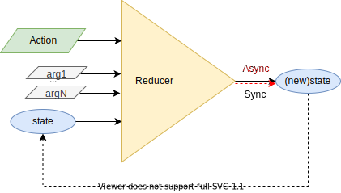
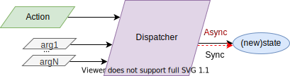

<p align="center">
  
</p>

<h1 align="center">Asynchronous/Synchronous React Reducer/Mapper Provider with Hooks</h1>

<p align="center">Flux/Redux made easy and beyond</p>

[](https://www.npmjs.com/package/react-reducer-provider)
[](https://www.npmjs.com/package/react-reducer-provider)
[](LICENSE.txt)
[](https://gitlab.com/gmullerb/react-reducer-provider/pipelines)
[](https://github.com/gmullerb/react-reducer-provider)
[](https://gitlab.com/gmullerb/react-reducer-provider)
__________________

## Quick Start

1 . Add dependency:

`package.json`:

```json
  ..
  "dependencies": {
    "react": "^16.8.0"
    "react-reducer-provider": "4.0.0",
    ..
```

2 . Create the **`AsyncReducerProvider`**, **`SyncReducerProvider`**, **`AsyncMapperProvider`** or **`SyncMapperProvider`** component to manage state:

A . Define the initial state.  
B . Define the reducer or mapper function.  
C . Define the Reducer or Mapper Provider.

**`SomeReducerProvider.jsx`**:

```jsx
import React from 'react'
import { SyncReducerProvider } from 'react-reducer-provider'

const initialState = 0

function reduce(prevState, action, param1) {
  switch (action) {
    case 'ACTION1':
      return prevState + param1
    case 'ACTION2':
      return prevState - param1
    default:
      return prevState
  }
}

function SomeReducerProvider({ children }) {
  return (
    <SyncReducerProvider
      reducer={reduce}
      initialState={initialState}
    >
      {children}
    </SyncReducerProvider>
  )
}

export default SomeReducerProvider
```

3 . Access the Provider component using `'react-reducer-provider'` hooks:

* **`useReducer`/`useMapper`**.
* **`useReducerDispatcher`/`useMapperDispatcher`**.
* **`useReducerState`/`useMapperState`**.

`SomeComponent1.jsx`[1] => using `useReducer`:

```jsx
import { useReducer } from 'react-reducer-provider'
import React from 'react'

export default function SomeComponent1() {
  const [ state, dispatch ] = useReducer()
  return (
    <button onClick={() => dispatch('ACTION1', 2)}>
      Go up (from {state})!
    </button>
  )
}
```

`SomeComponent2.jsx`[1] => using `useReducerDispatcher`:

```jsx
import { useReducerDispatcher } from 'react-reducer-provider'
import React from 'react'

export default function SomeComponent2() {
  const dispatch = useReducerDispatcher()
  return (
    <button onClick={() => {
      const newState = dispatch('ACTION2', 1)
      console.info(newState)
    }}>
      Go down!
    </button>
  )
}
```

`SomeComponentN.jsx`[1] => using `useReducerState`:

```jsx
import { useReducerState } from 'react-reducer-provider'
import React from 'react'

export default function SomeComponentN() {
  const currentState = useReducerState()
  return (
    <div>
      Current:{currentState}
    </div>
  )
}
```

4 . Wrap components which will consume the `SomeReducerProvider` component:

`SomeContainer.jsx`:

```jsx
import SomeComponent1 from './path/to/SomeComponent1'
import SomeComponent2 from './path/to/SomeComponent2'
import SomeComponentN from './path/to/SomeComponentN'
import SomeReducerProvider from '../path/to/SomeReducerProvider'
import React from 'react'

export default function SomeContainer() {
  return (
    <SomeReducerProvider>
      <SomeComponent1/>
      <SomeComponent2/>
      <SomeComponentN/>
    </SomeReducerProvider>
  )
}
```

> This `SyncReducerProvider` example can be checked on line at [gmullerb-react-reducer-provider codesandbox](https://codesandbox.io/s/gmullerb-react-reducer-provider-qf356?module=%2Fsrc%2FSomeReducerProvider.jsx):  
[](https://codesandbox.io/s/gmullerb-react-reducer-provider-qf356?module=%2Fsrc%2FSomeReducerProvider.jsx)  
> An `AsyncReducerProvider` example can be checked on line at [gmullerb-react-reducer-provider-async codesandbox](https://codesandbox.io/s/gmullerb-react-reducer-provider-async-m1fph?module=%2Fsrc%2FSomeReducerProvider.jsx):  
[](https://codesandbox.io/s/gmullerb-react-reducer-provider-async-m1fph?module=%2Fsrc%2FSomeReducerProvider.jsx)  
> An `SyncMapperProvider` example can be checked on line at [gmullerb-react-mapper-provider codesandbox](https://codesandbox.io/s/gmullerb-react-mapper-provider-c7hyq?module=%2Fsrc%2FSomeMapperProvider.jsx):  
[](https://codesandbox.io/s/gmullerb-react-mapper-provider-c7hyq?module=%2Fsrc%2FSomeMapperProvider.jsx)  
> An `AsyncMapperProvider` example can be checked on line at [gmullerb-react-mapper-provider-async codesandbox](https://codesandbox.io/s/gmullerb-react-mapper-provider-async-i9iyk?module=%2Fsrc%2FSomeMapperProvider.jsx):  
[](https://codesandbox.io/s/gmullerb-react-mapper-provider-async-i9iyk?module=%2Fsrc%2FSomeMapperProvider.jsx)  
> Examples of use can be looked at [basecode-react-ts](https://github.com/gmullerb/basecode-react-ts), [basecode-cordova-react-ts](https://github.com/gmullerb/basecode-cordova-react-ts), [candy-react-router](https://www.npmjs.com/package/candy-react-router) and [test files](tests/js).  
> [1] Injection can be used in order to improve design, but in favor of quick example this was surrender, look at [Injection](readme/with-injection.md) for injection example.
__________________

## Goal

With the introduction of React Hooks, in some way using Flux **library**[1] was deprecated, `react-reducer-provider` looks to **give a quick and easy alternative using hooks to implement Flux with reducers**.

* Provides Reducers, but also **Mappers**.
* It allows to use [**Asynchronous** Reducer/Mapper/Dispatcher](readme/reference.md#asyncreducerprovider).
* [Reducer/Mapper/Dispatcher can have **more parameters/arguments** than traditional reducer which have only (state, action)](readme/reference.md#extraparameters).
* [Dispatcher **returns the new State or a Promise of the new State**](readme/reference.md#dispatcher).
* [Each Reducer/Mapper Provider can have a **different names, numbers or symbols which allows for easy identification and nesting**](readme/reference.md#nesting).
* It is ready for Tree Shaking optimization, so you get only what you need from the `react-reducer-provider` in the final app bundle.
* It provides [its own **type definitions for Typescript and Flow**](readme/typings.md).
* Full Tested (not only focus in coverage, but also in cases).






> [1] Not the Flux architecture.  
> `react-reducer-provider` is the evolution of [react-named-reducer](https://www.npmjs.com/package/react-named-reducer) (which is a derivation of [react-reducer-context](https://www.npmjs.com/package/react-reducer-context)).
__________________

## Documentation

* [`AsyncReducerProvider`,`SyncReducerProvider`,`AsyncMapperProvider`&`SyncMapperProvider`](readme/reference.md#definition).
* [`useReducer`,`useReducerState`,`useReducerDispatcher`,`useMapper`,`useMapperState`&`useMapperDispatcher`](readme/reference.md#consumption).
* [Nesting](readme/reference.md#nesting).
* [Typings](readme/typings.md).
* [Prerequisites](readme/reference.md#prerequisites).
* Extras:
  * [With Injection](readme/with-injection.md).
    * [with Flow typings](readme/with-injection-and-flow-typings.md).
    * [with Typescript typings](readme/with-injection-and-ts-typings.md).
  * [With Actions Creators](readme/with-actions-creators.md).
    * [with Flow typings](readme/with-actions-creators-and-flow-typings.md).
    * [with Typescript typings](readme/with-actions-creators-and-ts-typings.md).
  * [Testing](readme/testing.md).
  * [Online examples](readme/online.md).
  * [Migration from `react-named-reducer` to `react-reducer-provider`](readme/migration.md).
  * [Extending/Developing](readme/developing.md).

* [`CHANGELOG.md`](CHANGELOG.md): add information of notable changes for each version here, chronologically ordered ([Keep a Changelog](http://keepachangelog.com)).

## Contributing

* **Use it**.
* **Share it**.
* [Give it a Star](https://github.com/gmullerb/react-reducer-provider).
* [Propose changes or improvements](https://github.com/gmullerb/react-reducer-provider/issues).
* [Report bugs](https://github.com/gmullerb/react-reducer-provider/issues).

## License

[MIT License](LICENSE.txt)
__________________

## Remember

* Use code style verification tools => Encourages Best Practices, Efficiency, Readability and Learnability.
* Start testing early => Encourages Reliability and Maintainability.
* Code Review everything => Encourages Functional suitability, Performance Efficiency and Teamwork.

## Additional words

Don't forget:

* **Love what you do**.
* **Learn everyday**.
* **Learn yourself**.
* **Share your knowledge**.
* **Think different!**.
* **Learn from the past, dream on the future, live and enjoy the present to the max!**.
* **Enjoy and Value the Quest** (It's where you learn and grow).

At life:

* Let's act, not complain.
* Be flexible.

At work:

* Let's give solutions, not questions.
* Aim to simplicity not intellectualism.
