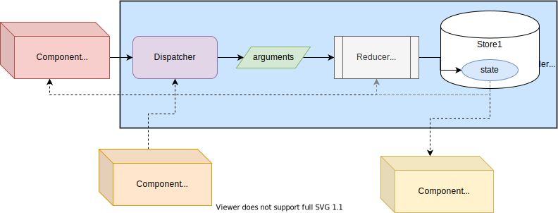

# `useReducer` · `useReducerState` · `useReducerDispatcher` · `useMapper` · `useMapperState` · `useMapperDispatcher`

(React ≥ 16.8.0)

## Consumption

Reducer or Mapper will never be accessible directly from `children` elements, they will be **able to access the State and/or Dispatcher**.

There are different ways of doing this:

* **`useReducer`**, which give access both State and [`Dispatcher`](../src/react-reducer-provider.d.ts).
* **`useReducerDispatcher`**, which give access only the [`Dispatcher`](../src/react-reducer-provider.d.ts).
* **`useReducerState`**, which give access only the State.

or

* **`useMapper`**, which give access both State and [`Dispatcher`](../src/react-reducer-provider.d.ts).
* **`useMapperDispatcher`**, which give access only the [`Dispatcher`](../src/react-reducer-provider.d.ts).
* **`useMapperState`**, which give access only the State.



> When using `useReducer`/`useMapper`, `useReducerDispatcher`/`useMapperDispatcher` and/or `useReducerState`/`useMapperState`,  Be Aware that they use [`React.useContext`](https://reactjs.org/docs/hooks-reference.html#usecontext) and quote: 'A component calling useContext will always re-render when the context value changes', in this case when `state` changes, therefore when using `useReducerDispatcher`/`useMapperDispatcher` although it not depends "directly" on `state` the component will be re-render when `state` changes. Final words, use `SyncMapperProvider` and/or `AsyncMapperProvider`,`SyncReducerProvider` and/or `AsyncReducerProvider` everywhere is required and use `useReducer`/`useMapper`, `useReducerDispatcher`/`useMapperDispatcher` and/or `useReducerState`/`useMapperState` wisely (small scopes, as close to where is required with small amount of children). If children re-render is too expensive then `React.useMemo`:

```jsx
const FunComponent1 = () => {
  const dispatch = useReducerDispatcher('testNamedReducer10')
  return React.useMemo(() => (
    <RelatedChildComponent
      onClick={dispatch}
    />
  ), [dispatch])
}
```

(check test case 'should get the same dispatcher references after state changes' at [SyncReducerProvider.test.jsx](../tests/js/SyncReducerProvider.test.jsx) or [AsyncReducerProviderWithAsync.test.jsx](../tests/js/AsyncReducerProviderWithAsync.test.jsx))

### `useReducer`/`useMapper`

`useReducer(id)`  
`useMapper(id)`

*parameters*:

* `id ?: string | number | symbol`: constitutes the identifier (name, number or symbol) of the `SyncReducerProvider`, `AsyncReducerProvider`,`SyncMapperProvider` or `AsyncMapperProvider` being accessed.

*returns*:

a tuple containing:

* `[0]`: the `state`.
* `[1]`: the `dispatcher`.
* `[2]`: the provider id.
* `state`: the `state`.
* `dispatch`: the `dispatcher`.
* `provider`: the provider id.

> Trying to reassign `state`, `dispatch`, `provider`, `[0]`, `[1]` or `[2]` will result in a`TypeError: Cannot assign to read only property '..' of object '[object Array]'` Exception.  
> Trying to add new fields will result in a `TypeError: can't define property "..": Array is not extensible` Exception.  
> For purpose of avoiding re-renders and/or improving performance **always use the elements of the tuple** as reference, never the tuple perse, keep in mind that the tuple that is returned may change but elements will only change when state changes. Also, can use `useEffect/useMemo/useCallback`. This is not an "issue" when using the elements of the tuple as reference or when using `use*Dispatcher` or `use*State`.

```jsx
import { useReducer } from 'react-reducer-provider'
import React from 'react'

export default function SomeComponent1() {
  const [ state, dispatch ] = useReducer('someNamedReducer')
  return (
    <button onClick={() => dispatch('ACTION1')}>
      Go up (from {state})!
    </button>
  )
}
```

or

```jsx
import { useReducer } from 'react-reducer-provider'
import React from 'react'

export default function SomeComponent1() {
  const { state, dispatch } = useReducer('someNamedReducer')
  return (
    <button onClick={() => dispatch('ACTION1')}>
      Go up (from {state})!
    </button>
  )
}
```

### `useReducerDispatcher`/`useMapperDispatcher`

`useReducerDispatcher(id)`  
`useMapperDispatcher(id)`

*parameters*:

* `id ?: string | number | symbol`: constitutes the identifier (name, number or symbol) of the `SyncReducerProvider`, `AsyncReducerProvider`,`SyncMapperProvider` or `AsyncMapperProvider` being accessed.

*returns*:

* the `dispatcher` of the respective Reducer/Mapper Provider.

```jsx
import { useReducerDispatcher } from 'react-reducer-provider'
import React from 'react'

export default function SomeComponent2() {
  const dispatch = useReducerDispatcher('someNamedReducer')
  return (
    <button onClick={() => dispatch('ACTION2')}>
      Go down!
    </button>
  )
}
```

### `useReducerState`/`useMapperState`

`useReducerState(id)`  
`useMapperState(id)`

*parameters*:

* `id ?: string | number | symbol`: constitutes the identifier (name, number or symbol) of the `SyncReducerProvider`, `AsyncReducerProvider`,`SyncMapperProvider` or `AsyncMapperProvider` being accessed.

*returns*:

* the `state` of the respective Reducer/Mapper Provider.

```jsx
import { useReducerState } from 'react-reducer-provider'
import React from 'react'

export default function SomeComponentN() {
  const currentState = useReducerState('someNamedReducer')
  return (
    <div>
      Current:{currentState}
    </div>
  )
}
```

### Error

When the associated Reducer Provider can not be found, i.e. the `id` trying to be used by any `react-reducer-provider` hook is not defined, the the following error may appear:

`TypeError: Cannot read property '_context' of undefined`

Check the `id` of the defined Reducer Providers, and use a valid one.

## Synchronous Consumption

### `Dispatcher`

* when accessing the Reducer Provider, the `dispatcher` will be also a synchronous function:

    `function dispatch<ACTION>(action: ACTION): void`

    e.g.:

```jsx
  export default function SomeComponent2() {
    const dispatch = useReducerDispatcher('someNamedReducer')
    return (
      <button onClick={() => dispatch('ACTION2')}>
        Go down!
      </button>
    )
  }
```

> An `SyncReducerProvider` example can be checked on line at [gmullerb-react-reducer-provider codesandbox](https://codesandbox.io/s/gmullerb-react-reducer-provider-forked-pjkve?file=/src/SomeReducerProvider.jsx):  
[](https://codesandbox.io/s/gmullerb-react-reducer-provider-forked-pjkve?file=/src/SomeReducerProvider.jsx)  
> An `SyncMapperProvider` example can be checked on line at [gmullerb-react-mapper-provider codesandbox](https://codesandbox.io/s/gmullerb-react-mapper-provider-forked-kwqfo?file=/src/SomeMapperProvider.jsx):  
[](https://codesandbox.io/s/gmullerb-react-mapper-provider-forked-kwqfo?file=/src/SomeMapperProvider.jsx)  

## Asynchronous Consumption

### Dispatcher

* when accessing the Reducer Provider, the `dispatcher` will be also a **asynchronous** function:

    `async function dispatch<ACTION>(action: ACTION): Promise<void>`

    e.g.:

```jsx
  export default function SomeComponent2() {
    const dispatch = useReducerDispatcher('someNamedReducer')
    return (
      <button onClick={(async () => dispatch('ACTION2').then(someProcess())}>
        Go down!
      </button>
    )
  }
```

> When the `dispatch` is resolved is an indication that the state was change, but not of any required re-rendering being done.  
> An `AsyncReducerProvider` can be checked on line at [gmullerb-react-reducer-provider codesandbox](https://codesandbox.io/s/gmullerb-react-reducer-provider-forked-pjkve?file=/src/SomeReducerProvider.jsx):  
[](https://codesandbox.io/s/gmullerb-react-reducer-provider-forked-pjkve?file=/src/SomeReducerProvider.jsx)  
> An `AsyncMapperProvider` example can be checked on line at [gmullerb-react-mapper-provider-async codesandbox](https://codesandbox.io/s/gmullerb-react-mapper-provider-async-forked-d2foz?file=/src/SomeMapperProvider.jsx):  
[](https://codesandbox.io/s/gmullerb-react-mapper-provider-async-forked-d2foz?file=/src/SomeMapperProvider.jsx)  
> Although `AsyncReducerProvider` can be used for synchronous reducer/dispatcher (check [AsyncReducerProviderWithSync.test.jsx](tests/js/AsyncReducerProviderWithSync.test.jsx)), It is not is purpose and implementation is suitable for asynchronous processes, long story short, for synchronous processes, use `SyncReducerProvider`.  
> Examples of use can be looked at [basecode-react-ts](https://github.com/gmullerb/basecode-react-ts) and [basecode-cordova-react-ts](https://github.com/gmullerb/basecode-cordova-react-ts).  

__________________

## More Documentation

* [`AsyncReducerProvider` · `SyncReducerProvider` · `AsyncMapperProvider` · `SyncMapperProvider`](reference-defintion.md).
* [`injectReducer` · `injectReducerState` · `injectReducerDispatcher` · `injectMapper` · `injectMapperState` · `injectMapperDispatcher`](reference-consumption-hoc.md).
* [Singleton](singleton.md).
* [Nesting](nesting.md).
* Combining/Blending - Tagged Reducers/Mappers.
  * [`AsyncTaggedReducerProvider` · `SyncTaggedReducerProvider` · `AsyncTaggedMapperProvider` · `SyncTaggedMapperProvider`](tagged-definition.md).
  * [`useTaggedAny` · `useTaggedReducer` · `useTaggedReducerState` · `useTaggedReducerDispatcher` · `useTaggedMapper` · `useTaggedMapperState` · `useTaggedMapperDispatcher`](tagged-consumption-hooks.md).
  * [`injectTaggedAny` · `injectTaggedReducer` · `injectTaggedReducerState` · `injectTaggedReducerDispatcher` · `injectTaggedMapper` · `injectTaggedMapperState` · `injectTaggedMapperDispatcher`](tagged-consumption-hoc.md).
* [Typings](typings.md).
* [With Injection](with-injection.md).
  * [with Flow typings](with-injection-and-flow-typings.md).
  * [with Typescript typings](with-injection-and-ts-typings.md).
* [With Actions Creators](with-actions-creators.md).
  * [with Flow typings](with-actions-creators-and-flow-typings.md).
  * [with Typescript typings](with-actions-creators-and-ts-typings.md).
* [Testing](testing.md).
* [Examples from tests](../tests/js).
* **[Online examples](online.md)**.
* [Typings' examples from tests](../tests/typings).
* [Extending/Developing](developing.md).

## Main documentation

[Back](../README.md)
