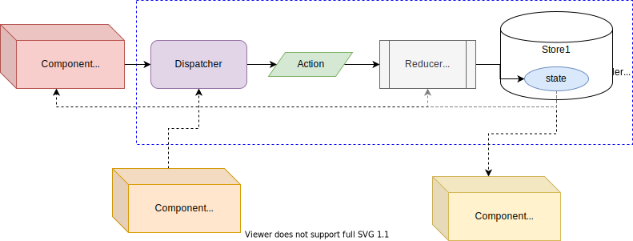

# Combining/Blending - Tagged Reducers/Mappers

## Consumption

Reducer or Mapper will never be accessible directly from `children` elements, they will be **able to access the State and/or Dispatcher**.

There are different ways of doing this:

* **`injectTaggedReducer`**, which give access both State and [`Dispatcher`](https://github.com/gmullerb/react-reducer-provider/blob/master/src/react-reducer-provider.d.ts).
* **`injectTaggedReducerDispatcher`**, which give access only the [`Dispatcher`](https://github.com/gmullerb/react-reducer-provider/blob/master/src/react-reducer-provider.d.ts).
* **`injectTaggedReducerState`**, which give access only the State.

or

* **`injectTaggedMapper`**, which give access both State and [`Dispatcher`](https://github.com/gmullerb/react-reducer-provider/blob/master/src/react-reducer-provider.d.ts).
* **`injectTaggedMapperDispatcher`**, which give access only the [`Dispatcher`](https://github.com/gmullerb/react-reducer-provider/blob/master/src/react-reducer-provider.d.ts).
* **`injectTaggedMapperState`**, which give access only the State.

or

* injectTaggedAny, which give access any tagged State and [`Dispatcher`](https://github.com/gmullerb/react-reducer-provider/blob/master/src/react-reducer-provider.d.ts).



> When using any `injectTagged*`, ,  Be Aware that they use `React Consumer`, a Consumer component will always re-render when the context value changes, in this case when `state` changes, therefore when using `injectReducerDispatcher`/`injectMapperDispatcher` although it not depends "directly" on `state` the component will be re-render when `state` changes. Final words, use `SyncMapperProvider` and/or `AsyncMapperProvider`,`SyncReducerProvider` and/or `AsyncReducerProvider` everywhere is required and use `injectReducer`/`injectMapper`, `injectReducerDispatcher`/`injectMapperDispatcher` and/or `injectReducerState`/`injectMapperState` wisely (small scopes, as close to where is required with small amount of children).

### `injectTaggedReducer`/`injectTaggedMapper`

`injectTaggedReducer(ComponentClass, injectedPropName, tag, id)`  
`injectTaggedMapper(ComponentClass, injectedPropName, tag, id)`

*parameters*:

* `ComponentClass: class`: Component class to be enhanced with `react-reducer-provider` properties.
* `injectedPropName: string`: Desired name of the property to be injected that correspond to the reducer/mapper (Be sure to avoid collision).
* `tag: string | number | symbol`: that identifies an actions/reducer/state combination.
* `id?: string | number | symbol`: constitutes the identifier of the `*TaggedProvider` being accessed.

> :exclamation: No Error checking is done behind the scene for Tag, so "keep track" of tags (to avoid getting a `undefined` error).

*returns*:

* Enhanced Component Class with the indicated property, which holds a tuple containing:

* `[0]`: the `state`.
* `[1]`: the `dispatcher`.
* `[2]`: the provider id.
* `[3]`: respective provider tag.
* `state`: the `state`.
* `dispatch`: the `dispatcher`.
* `provider`: the provider id.
* `tag`: respective provider tag.

> Trying to reassign `state`, `dispatch`, `provider`, `tag`, `[0]`, `[1]`, `[2]` or `[3]` will result in a`TypeError: Cannot assign to read only property '..' of object '[object Array]'` Exception.  
> Trying to add new fields will result in a `TypeError: can't define property "..": Array is not extensible` Exception.  
> For purpose of avoiding re-renders and/or improving performance **always use the elements of the tuple** as reference, never the tuple perse, keep in mind that the tuple that is returned may change but elements will only change when state changes. This is not an "issue" when using the elements of the tuple as reference or when using `inject*Dispatcher` or `inject*State`.
Accessing Specific Tagged Reducer/Mapper:

```jsx
import { injectTaggedMapper } from 'react-reducer-provider'
import React from 'react'

class ClassComponentA11 extends React.Component {
  render() {
    const [ state, dispatch, tag ] = this.props.mapper
    return (
      <button onClick={() => dispatch('ACTION1')}>
        Click{state}
      </button>
    )
  }
}
const ClassComponent11 = injectTaggedMapper(ClassComponentA11, 'mapper', 'Tag1', 497)
```

or

```jsx
import { injectTaggedMapper } from 'react-reducer-provider'
import React from 'react'

class ClassComponentA11 extends React.Component {
  render() {
    const { state, dispatch, tag } = this.props.mapper
    return (
      <button onClick={() => dispatch('ACTION1')}>
        Click{state}
      </button>
    )
  }
}
const ClassComponent11 = injectTaggedMapper(ClassComponentA11, 'mapper', 'Tag1', 497)
```

Accessing Singleton Tagged Reducer/Mapper:

```jsx
import { injectTaggedReducer } from 'react-reducer-provider'
import React from 'react'

class ClassComponentA1 extends React.Component {
  render() {
    const [ state, dispatch, tag ] = this.props.reducer
    return (
      <button onClick={() => dispatch('ACTION1')}>
        Click{state}
      </button>
    )
  }
}
const ClassComponent11 = injectTaggedReducer(ClassComponentA11, 'reducer', 'Tag1')
```

or

```jsx
import { injectTaggedMapper } from 'react-reducer-provider'
import React from 'react'

class ClassComponentA1 extends React.Component {
  render() {
    const { state, dispatch, tag } = this.props.mapper
    return (
      <button onClick={() => dispatch('ACTION1')}>
        Click{state}
      </button>
    )
  }
}
const ClassComponent11 = injectTaggedMapper(ClassComponentA11, 'mapper', 'Tag1')
```

### `injectTaggedAny`

`injectTaggedAny(ComponentClass, injectedPropName, id)`

*parameters*:

* `ComponentClass: class`: Component class to be enhanced with `react-reducer-provider` properties.
* `injectedPropName: string`: Desired name of the property to be injected (Be sure to avoid collision).
* `id?: string | number | symbol`: constitutes the identifier of the `*TaggedProvider` being accessed.

*returns*:

* Enhanced Component Class with the indicated property, which holds a function `get` to obtain the any provider value.

Accessing Specific Tagged Reducer/Mapper:

```jsx
import { injectTaggedAny } from 'react-reducer-provider'
import React from 'react'

class ClassComponentA1 extends React.Component {
  render() {
      const [ state, dispatch ] = this.props.reducers.get('Tag1')
      return (
        <button onClick={() => dispatch('ACTION1')}>
          Go up (from {state})!
        </button>
      )
  }
}
const ClassComponent11 = injectTaggedAny(ClassComponentA11, 'reducers', 'someTaggedReducerS0')
```

Accessing Singleton Tagged Reducer/Mapper:

```jsx
import { injectTaggedAny } from 'react-reducer-provider'
import React from 'react'

class ClassComponentA1 extends React.Component {
  render() {
      const { state, dispatch } = this.props.reducers.get('Tag1')
      return (
        <button onClick={() => dispatch('ACTION1')}>
          Go up (from {state})!
        </button>
      )
  }
}
const ClassComponent11 = injectTaggedAny(ClassComponentA11, 'reducers')
```

### `injectTaggedReducerDispatcher`/`injectTaggedMapperDispatcher`

`injectTaggedReducerDispatcher(ComponentClass, injectedPropName, tag, id)`  
`injectTaggedMapperDispatcher(ComponentClass, injectedPropName, tag, id)`

*parameters*:

* `ComponentClass: class`: Component class to be enhanced with `react-reducer-provider` properties.
* `injectedPropName: string`: Desired name of the property to be injected that correspond to the dispatcher (Be sure to avoid collision).
* `tag: string | number | symbol`: that identifies an actions/reducer/state combination.
* `id?: string | number | symbol`: constitutes the identifier of the `*TaggedProvider` being accessed.

> :exclamation: No Error checking is done behind the scene for Tag, so "keep track" of tags (to avoid getting a `undefined` error).

*returns*:

* Enhanced Component Class with the indicated property, which holds the `dispatcher` of the respective Reducer/Mapper Provider.

Accessing Specific Tagged Reducer/Mapper:

```jsx
import { injectTaggedReducerDispatcher } from 'react-reducer-provider'
import React from 'react'

class ClassComponentA11 extends React.Component {
  render() {
    return (
      <button id='F1' onClick={() => this.props.dispatch('ACTION1')}>
        Click1
      </button>
    )
  }
}
const ClassComponent11 = injectTaggedReducerDispatcher(ClassComponentA11, 'dispatch', 'Tag1', 'someTaggedReducerS2')
```

Accessing Singleton Tagged Reducer/Mapper:

```jsx
import { injectTaggedReducerDispatcher } from 'react-reducer-provider'
import React from 'react'

class ClassComponentA11 extends React.Component {
  render() {
    return (
      <button id='F1' onClick={() => this.props.dispatch('ACTION1')}>
        Click1
      </button>
    )
  }
}
const ClassComponent11 = injectTaggedReducerDispatcher(ClassComponentA11, 'dispatch', 'Tag1')
```

### `injectTaggedReducerState`/`injectTaggedMapperState`

`injectTaggedReducerState(ComponentClass, injectedPropName, tag, id)`  
`injectTaggedMapperState(ComponentClass, injectedPropName, tag, id)`

*parameters*:

* `ComponentClass: class`: Component class to be enhanced with `react-reducer-provider` properties.
* `injectedPropName: string`: Desired name of the property to be injected that correspond to the state (Be sure to avoid collision).
* `tag: string | number | symbol`: that identifies an actions/reducer/state combination.
* `id?: string | number | symbol`: constitutes the identifier of the `*TaggedProvider` being accessed.

> :exclamation: No Error checking is done behind the scene for Tag, so "keep track" of tags (to avoid getting a `undefined` error).

*returns*:

* Enhanced Component Class with the indicated property, which holds the `state` of the respective Reducer/Mapper Provider.

Accessing Specific Tagged Reducer/Mapper:

```jsx
import { injectTaggedReducerState } from 'react-reducer-provider'
import React from 'react'

class ClassComponentAN2 extends React.Component {
  render() {
    return (
      <div>
        ChildN{this.props.state}
      </div>
    )
  }
}
const ClassComponentN2 = injectTaggedReducerState(ClassComponentAN2, 'state', 'TagN', 'someTaggedReducerS6')
```

Accessing Singleton Tagged Reducer/Mapper:

```jsx
import { injectTaggedReducerState } from 'react-reducer-provider'
import React from 'react'

class ClassComponentAN2 extends React.Component {
  render() {
    return (
      <div>
        ChildN{this.props.state}
      </div>
    )
  }
}
const ClassComponentN2 = injectTaggedReducerState(ClassComponentAN2, 'state', 'TagN')
```

__________________

## More Documentation

* [`AsyncTaggedReducerProvider` · `SyncTaggedReducerProvider` · `AsyncTaggedMapperProvider` · `SyncTaggedMapperProvider`](tagged-definition.md).
* [`useTaggedAny` · `useTaggedReducer` · `useTaggedReducerState` · `useTaggedReducerDispatcher` · `useTaggedMapper` · `useTaggedMapperState` · `useTaggedMapperDispatcher`](tagged-consumption-hooks.md).
* [`AsyncReducerProvider`,`SyncReducerProvider`,`AsyncMapperProvider`&`SyncMapperProvider`](reference.md#definition).
* [`useReducer`,`useReducerState`,`useReducerDispatcher`,`useMapper`,`useMapperState`&`useMapperDispatcher`](reference.md#consumption)
* [`injectReducer` · `injectReducerState` · `injectReducerDispatcher` · `injectMapper` · `injectMapperState` · `injectMapperDispatcher`](reference-consumption-hoc.md).
* [Singleton](singleton.md).
* [Nesting Providers](nesting.md).
* [Typings](typings.md).
* [With Injection](with-injection.md).
  * [with Flow typings](with-injection-and-flow-typings.md).
  * [with Typescript typings](with-injection-and-ts-typings.md).
* [With Actions Creators](with-actions-creators.md).
  * [with Flow typings](with-actions-creators-and-flow-typings.md).
  * [with Typescript typings](with-actions-creators-and-ts-typings.md).
* [Testing](testing.md).
* [Examples from tests](https://github.com/gmullerb/react-reducer-provider/blob/master/tests/js).
* [Typings' examples from tests](https://github.com/gmullerb/react-reducer-provider/blob/master/tests/typings).
* [Extending/Developing](developing.md).

## Main documentation

[Back to homepage](../README.md)
