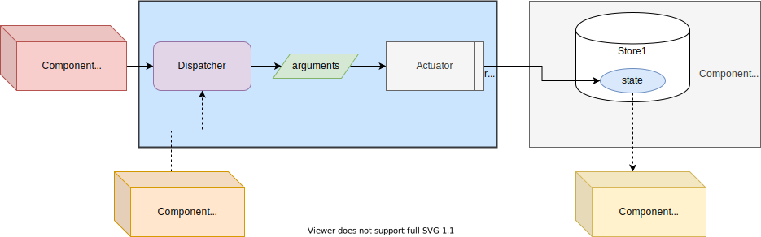
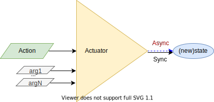
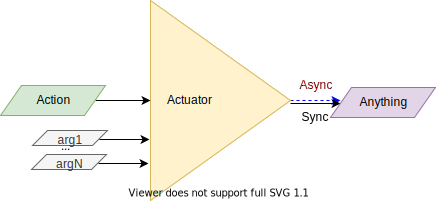
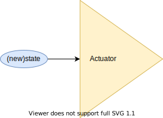
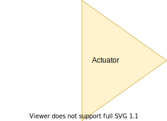
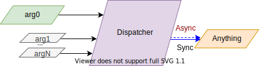

# Actuators

## `ActuatorProvider`

`ActuatorProvider` is a React Component which defines a [React Context](https://reactjs.org/docs/context.html) that allows to **Manage a external State**.

* It's a **bridge between a Store and Components**.
* It allows you to easily introduced **centralized state without moving your existing state**, i.e. it allows you to avoid using a new state container if you already have one.
* It can be used to managed other uses cases that not involved a centralized state but a **centralized action handling**.



`ActuatorProvider` is a React "Special" Elements defined by 2 properties:

*properties*:

* `id ?: string | number | symbol`: constitutes the identifier of the `ActuatorProvider`, which is useful when using more than 1 `react-reducer-provider` provider.

  * [Use `id` the "right" way](keep-track-id.md).

* `actuator`: an asynchronous or synchronous function that will be called from the remote components through actuator dispatcher.
  * That function then can handle the external state or do something else, as a response to its called, i.e. **Actuate**.
  * The value return by the `actuator` is send to the remote component.

Identified `AsyncMapperProvider`:

```jsx
<ActuatorProvider
  id='someActuator'
  actuator={actuate}
>
  {children}
</ActuatorProvider>
```

or Singleton `AsyncMapperProvider`:

```jsx
<ActuatorProvider actuator={actuate}>
  {children}
</ActuatorProvider>
```

`actuator` can receive the arguments to actuate and no return anything, e.g. to set a new centralized state value:


`actuator` can receive the arguments to set a new centralized state value and return its new value:


`actuator` can receive the arguments to actuate and return some result value:


`actuator` can even receive and set the new state value:


`actuator` can even receive no arguments, and be used as simple trigger:


> * `ActuatorProvider` is an Immutable React Component, i.e it will never re-render, so, if you need to render children:
>   * Re-render the parent, which is usually the case, i.e. the `ActuatorProvider`'s parent will change its state and re-render its children.
>   * Children will re-render themself when they change themself.
>   * Use the `key` approach to force children re-render: `<ActuatorProvider key={changingKey}`.

> Online example can be checked on line at [gmullerb-react-actuator-provider codesandbox](https://codesandbox.io/s/gmullerb-react-actuator-provider-5sl0o?file=/src/SomeContainer.jsx):  
[](https://codesandbox.io/s/gmullerb-react-actuator-provider-5sl0o?file=/src/SomeContainer.jsx)  

## Actuator Consumption

### Dispatcher

Dispatcher is the proxy between the Remote component and the Actuator:



Synchronous dispatcher:

```js
const result = dispatch(arg0, arg1, argN)
```

Asynchronous dispatcher:

```js
dispatch(arg0, arg1, argN).then(result => console.info(result))
```

If the actuator does not return a value, or returned value is not required:

```js
dispatch(arg0, arg1, argN)
```

> Examples can be seen at: [`ActuatorProvider.test.jsx`](https://github.com/gmullerb/react-reducer-provider/blob/master/tests/js/ActuatorProvider.test.jsx).  
> Examples of typings can be seen at: [`typingTestForActuator.tsx`](https://github.com/gmullerb/react-reducer-provider/blob/master/tests/js/typingTestForActuator.tsx) and [`typingTestForActuatorClass.tsx`](https://github.com/gmullerb/react-reducer-provider/blob/master/tests/js/typingTestForActuatorClass.tsx).

#### Exceptions

If actuator may throw an exception, then the code calling the dispatcher should handle this situations:

synchronous actuator

```js
  try {
    dispatch(arg0, arg1, argN)
    ..
  }
  catch(error)
  {
    ..
  }
```

asynchronous actuator

```js
  dispatch(arg0, arg1, argN)
    .then(..)
    .catch(error => ..)
  }
```

> * Remember you design the actuator, so you must be aware if exceptions are possible.
> * **In case of exceptions is better to handle them inside actuator**.

### Getting the Dispatcher

Dispatcher will be reachable through:

* Function Components - Hooks: **`useActuator`**.
* Class Components - HOC: **`injectActuator`**.


#### `useActuator`

**`useActuator`** gives access to the `Dispatcher` when using React Function Components.

`useActuator(id?)`

*parameters*:

* `id?: string | number | symbol`: constitutes the identifier (name, number or symbol) of the `ActuatorProvider` being accessed.

*returns*: the Dispatcher function with an additional field:

* `provider`: the provider id.

when using a Singleton Provider:

```jsx
const FunComponent1 = () => {
  const dispatch = useActuator()
  return (
    <RelatedChildComponent onEvent={dispatch} />
  )
}
```

or when using a Identified `ActuatorProvider`:

```jsx
const FunComponent1 = () => {
  const dispatch = useActuator('someActuator')
  return (
    <RelatedChildComponent onEvent={dispatch} />
  )
}
```

> Trying to reassign `provider` or add new fields to the Dispatcher function will result in a `TypeError` Exception.  

> Online example can be checked on line at [gmullerb-react-actuator-provider codesandbox](https://codesandbox.io/s/gmullerb-react-actuator-provider-5sl0o?file=/src/SomeComponent1.jsx):  
[](https://codesandbox.io/s/gmullerb-react-actuator-provider-5sl0o?file=/src/SomeComponent1.jsx)  
> Examples can be seen at: [`ActuatorProvider.test.jsx`](https://github.com/gmullerb/react-reducer-provider/blob/master/tests/js/ActuatorProvider.test.jsx).  
> Examples of typings can be seen at: [`typingTestForActuator.tsx`](https://github.com/gmullerb/react-reducer-provider/blob/master/tests/js/typingTestForActuator.tsx).

#### `injectActuator`

**`injectActuator`** gives access to the `Dispatcher` when using React Class Components.

`injectActuator(ComponentClass, injectedPropName, id?)`

*parameters*:

* `ComponentClass: class`: React Component class to be enhanced with `react-reducer-provider` properties.
* `injectedPropName: string`: Name of the property to be injected to the Class component that correspond to the `actuator` Dispatcher.
  * Can be any name just be sure to avoid collision with existing names on `ComponentClass`.
* `id?: string | number | symbol`: constitutes the identifier (name, number or symbol) of the `ActuatorProvider` being accessed.

*returns*: the Dispatcher function with an additional field:

**Enhanced Component Class** with the indicated `injectedPropName` property, which holds the Dispatcher function containing an additional field:

* `provider`: the provider id.

when using a Singleton Provider:

```jsx
class ClassComponent1 extends React.Component {
  render() {
    return (
      <RelatedChildComponent onEvent={this.props.dispatch} />
    );
  }
}

export default injectActuator(ClassComponent1, 'dispatch');
```

or when using a Identified `ActuatorProvider`:

```jsx
class ClassComponent1 extends React.Component {
  render() {
    return (
      <RelatedChildComponent onEvent={this.props.dispatch} />
    );
  }
}

export default injectActuator(ClassComponent1, 'dispatch', 'someActuator');
```

> Trying to reassign `provider` or add new fields to the Dispatcher function will result in a `TypeError` Exception.  

> Online example can be checked on line at [gmullerb-react-actuator-provider codesandbox](https://codesandbox.io/s/gmullerb-react-actuator-provider-5sl0o?file=/src/SomeComponent2.jsx):  
[](https://codesandbox.io/s/gmullerb-react-actuator-provider-5sl0o?file=/src/SomeComponent2.jsx)  
> Examples can be seen at: [`ActuatorProvider.test.jsx`](https://github.com/gmullerb/react-reducer-provider/blob/master/tests/js/ActuatorProvider.test.jsx).  
> Examples of typings can be seen at: [`typingTestForActuatorClass.tsx`](https://github.com/gmullerb/react-reducer-provider/blob/master/tests/js/typingTestForActuatorClass.tsx).

__________________

## Main documentation

[Back to homepage](../README.md)
