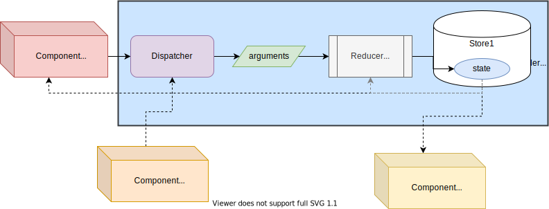

# Reducers

`SyncReducerProvider` & `AsyncReducerProvider` are React Components which defines a [React Context](https://reactjs.org/docs/context.html) that allows to Manage State using [Flux](http://facebook.github.io/flux), an application architecture that handles application states in a unidirectional way.

* Flux is composed basically with:
  * Stores: keeps states of the app (or components).
    * Reducer: function that changes the State based on an Action and the previous State.
  * Actions: triggers changes in Store.
  * Dispatcher: sends Actions to the Store.
    * Mainly the bridge between the Store and Components.


Each `SyncReducerProvider` or `AsyncReducerProvider` is equivalent to a Flux stream:


## `SyncReducerProvider`


`SyncReducerProvider` is a React "Special" Elements defined by 3 properties:

*properties*:

* `initialState`: inception state for the component or a function to create initial state.
* `id ?: string | number | symbol`: constitutes the identifier of the `SyncReducerProvider`, which is useful when using more than 1 `react-reducer-provider` provider.
  * [**Use `id` the "right" way**](keep-track-id.md).
* `reducer`: a synchronous function that will receive the current state and an action to produce a new state.

```jsx
<SyncReducerProvider
  id='someNamedReducer'
  reducer={syncReduce}
  initialState={initialState}
>
  {children}
</SyncReducerProvider>
```

`function syncReduce<STATE, [ACTION]>(prevState: STATE, action: ACTION): STATE`

e.g.:

```js
function reduce(prevState, action) {
  switch (action) {
    case 'ACTION1':
      return prevState + 1
    case 'ACTION2':
      return prevState - 1
    default:
      return prevState
  }
}
```

## `AsyncReducerProvider`


`AsyncReducerProvider` is a React "Special" Elements defined by 3 properties:

*properties*:

* `initialState`: inception state for the component or a function to create initial state.
* `id ?: string | number | symbol`: constitutes the identifier of the `AsyncReducerProvider`, which is useful when using more than 1 `react-reducer-provider` provider.
  * [**Use `id` the "right" way**](keep-track-id.md).
* `reducer`: an **asynchronous** function that will receive the current state and an action to produce a `Promise` of the new state[1].

Identified `AsyncReducerProvider`:

```jsx
<AsyncReducerProvider
  id={12345}
  reducer={asyncReduce}
  initialState={() => initialState}
>
  {children}
</AsyncReducerProvider>
```

or Singleton `AsyncReducerProvider`:

```jsx
<AsyncReducerProvider
  reducer={asyncReduce}
  initialState={initialState}
>
  {children}
</AsyncReducerProvider>
```

`function asyncReduce<STATE, [ACTION]>(prevState: STATE, action: ACTION): Promise<STATE>`

e.g.:

```js
async function reduce(prevState, action) {
  switch (action) {
    case 'ACTION1':
      return await someAsyncProcess1(prevState)
    case 'ACTION2':
      return someAsyncProcess2(prevState)
    default:
      return prevState
  }
}
```

> [1] No check is made for asynchronous reducer, i.e. use `AsyncReducerProvider` for asynchronous reducer to avoid *setting state to a `Promise`* (unless that is intentional).

### Properties change

Any change to the **initial Properties** for **mounted** State Providers will be ignored for rendering, in order to improve performance, but not for processing, i.e. props changes will not cause re-rendering, although the new reducers will be used for calculating new states.

* `id` change is totally ignored.
* new `reducer` will be used.
  * If `reducer` are set to `null` or `undefined`, then it will disabled the processor and return the last state achieved for every following dispatching until a new `reducer` is set again.
* new `initialState` will be ignored.

> A example can be checked on line at [gmullerb-react-reducer-provider with a function as a state codesandbox](https://codesandbox.io/s/gmullerb-react-reducer-provider-forked-fip9b?file=/src/SomeReducerProvider.jsx):  
[](https://codesandbox.io/s/gmullerb-react-reducer-provider-forked-fip9b?file=/src/SomeReducerProvider.jsx)

> If unmounted, olds state will be lost when mounted again and a new fresh state will be used.

### A Function as State

To initialize the state as a function, `initialState` must be set with a function:

```jsx
<SyncReducerProvider
  id='someNamedReducer'
  reducer={asyncReducer}
  initialState={() => (x, y) => x + y}
>
  {children}
</SyncReducerProvider>
```

> A example can be checked on line at [gmullerb-react-mapper-provider with a function as a state codesandbox](https://codesandbox.io/s/gmullerb-react-mapper-provider-forked-qhtqw?file=/src/SomeMapperProvider.jsx):  
[](https://codesandbox.io/s/gmullerb-react-mapper-provider-forked-qhtqw?file=/src/SomeMapperProvider.jsx)  

## Reducer Consumption

### `Dispatcher`

[`Dispatcher`](https://github.com/gmullerb/react-reducer-provider/blob/master/src/react-reducer-provider.d.ts) is the proxy between the Remote component and the Reducer, and returns the new State or a Promise of the new State:


Synchronous dispatcher:

```js
const newState = dispatch(action)
```

Asynchronous dispatcher:

```js
dispatch(action).then(newState => console.info(newState))
```

If the Reducer returned value is not required:

```js
dispatch(action)
```

Remember:

when accessing a synchronous Reducer Provider, the `dispatcher` will be also a synchronous function.

> Online example can be checked on line at [gmullerb-react-reducer-provider codesandbox](https://codesandbox.io/s/gmullerb-react-reducer-provider-forked-pjkve?file=/src/SomeReducerProvider.jsx):  
[](https://codesandbox.io/s/gmullerb-react-reducer-provider-forked-pjkve?file=/src/SomeReducerProvider.jsx)  

when accessing an **asynchronous** Reducer Provider, the `dispatcher` will be also a **asynchronous** function:

`async function dispatch<ACTION>(action: ACTION): Promise<void>`

e.g.:

```jsx
  dispatch('ACTION2').then(someProcess())
```

> When the `dispatch` is resolved is an indication that the state was change, but not of any required re-rendering being done.  
> Online example can be checked on line at [gmullerb-react-reducer-provider-async codesandbox](https://codesandbox.io/s/gmullerb-react-reducer-provider-async-forked-cyl3g?file=/src/SomeReducerProvider.jsx):  
[](https://codesandbox.io/s/gmullerb-react-reducer-provider-async-forked-cyl3g?file=/src/SomeReducerProvider.jsx)  

### Exceptions

If reducer may throw an exception, then the code calling the dispatcher should handle this situations:

synchronous reducer

```js
  try {
    dispatch('Tag1', 'ACTION1')
    ..
  }
  catch(error)
  {
    ..
  }
```

asynchronous reducer

```js
  dispatch('Tag1', 'ACTION1')
    .then(..)
    .catch(error => ..)
  }
```

> * Remember you design the reducer, so you must be aware if exceptions are possible.
> * **In case of exceptions is better to handle them inside reducer**.

## Extra parameters

Dispatcher can send **any number of additional arguments**:


Synchronous:

```js
  dispatch('ACTION2', arg1, arg2, argN)
```

Asynchronous:

```js
  dispatch('ACTION2', arg1, arg2, argN).then(someProcess())
```

Then, respectively:

* Reducer can have **any number of additional parameters**, and use them as pleased:


```js
async function reduce(prevState, action, param1, param2, paramN) {
  switch (action) {
    case 'ACTION1':
      return await someAsyncProcess1(prevState, param1, param2, paramN)
    case 'ACTION2':
      return someAsyncProcess2(prevState, param1, param2, paramN)
    default:
      return prevState
  }
}
```

> An example can be checked on line at [gmullerb-react-reducer-provider-async codesandbox](https://codesandbox.io/s/gmullerb-react-reducer-provider-async-forked-ncsyy?file=/src/SomeReducerProvider.jsx):  
[](https://codesandbox.io/s/gmullerb-react-reducer-provider-async-forked-ncsyy?file=/src/SomeReducerProvider.jsx)  
> This makes "obsolete" the [Action](typings.md#helpertypes) helper type, but at the end can be matter of preference.

### Getting the Dispatcher

Dispatcher will be reachable through:

* Function Components - Hooks: **`useReducer`**, **`useReducerDispatcher`** and **`useReducerState`**.
* Class Components - HOC: **`injectReducer`**, **`injectReducerDispatcher`** and **`injectReducerState`**.



#### `useReducer`

**`useReducer`** gives access to both, State and [`Dispatcher`](https://github.com/gmullerb/react-reducer-provider/blob/master/src/react-reducer-provider.d.ts) when using React Function Components.

`useReducer(id)`

*parameters*:

* `id?: string | number | symbol`: constitutes the identifier (name, number or symbol) of the `SyncReducerProvider` or `AsyncReducerProvider` being accessed.

*returns*:

a tuple containing:

* `[0]`: the `state`.
* `[1]`: the `dispatcher`.
* `[2]`: the provider id.
* `state`: the `state`.
* `dispatch`: the `dispatcher`.
* `provider`: the provider id.

when using a Singleton Provider:

```jsx
import { useReducer } from 'react-reducer-provider'
import React from 'react'

export default function SomeComponent1() {
  const [ state, dispatch ] = useReducer()
  return (
    <button onClick={() => dispatch('ACTION1')}>
      Go up (from {state})!
    </button>
  )
}
```

or when using an Identified `SyncReducerProvider` or `AsyncReducerProvider`:

```jsx
import { useReducer } from 'react-reducer-provider'
import React from 'react'

export default function SomeComponent1() {
  const [ state, dispatch ] = useReducer('someNamedReducer')
  return (
    <button onClick={() => dispatch('ACTION1')}>
      Go up (from {state})!
    </button>
  )
}
```

> Online example can be checked on line at [gmullerb-react-reducer-provider codesandbox](https://codesandbox.io/s/gmullerb-react-reducer-provider-forked-pjkve?file=/src/SomeComponent1.jsx):  
> [](https://codesandbox.io/s/gmullerb-react-reducer-provider-forked-pjkve?file=/src/SomeComponent1.jsx)  

#### `useReducerDispatcher`

**`useReducerDispatcher`** gives access only to the [`Dispatcher`](https://github.com/gmullerb/react-reducer-provider/blob/master/src/react-reducer-provider.d.ts) when using React Function Components.

`useReducerDispatcher(id)`

*parameters*:

* `id?: string | number | symbol`: constitutes the identifier (name, number or symbol) of the `SyncReducerProvider` or `AsyncReducerProvider` being accessed.

*returns*:

* the `dispatcher` of the respective Reducer Provider.

when using a Singleton Provider:

```jsx
import { useReducerDispatcher } from 'react-reducer-provider'
import React from 'react'

export default function SomeComponent2() {
  const dispatch = useReducerDispatcher()
  return (
    <button onClick={() => dispatch('ACTION2')}>
      Go down!
    </button>
  )
}
```

or when using an Identified `SyncReducerProvider` or `AsyncReducerProvider`:

```jsx
import { useReducerDispatcher } from 'react-reducer-provider'
import React from 'react'

export default function SomeComponent2() {
  const dispatch = useReducerDispatcher('someNamedReducer')
  return (
    <button onClick={() => dispatch('ACTION2')}>
      Go down!
    </button>
  )
}
```

> Online example can be checked on line at [gmullerb-react-reducer-provider codesandbox](https://codesandbox.io/s/gmullerb-react-reducer-provider-forked-pjkve?file=/src/SomeComponent2.jsx):  
> [](https://codesandbox.io/s/gmullerb-react-reducer-provider-forked-pjkve?file=/src/SomeComponent2.jsx)  

#### `useReducerState`

**`useReducerState`** gives access only to the State when using React Function Components.

`useReducerState(id)`

*parameters*:

* `id?: string | number | symbol`: constitutes the identifier (name, number or symbol) of the `SyncReducerProvider` or `AsyncReducerProvider` being accessed.

*returns*:

* the `state` of the respective Reducer Provider.

when using a Singleton Provider:

```jsx
import { useReducerState } from "react-reducer-provider";
import React from "react";

export default function SomeComponentN() {
  const currentState = useReducerState();
  return <div>Current:{currentState}</div>;
}
```

or when using an Identified `SyncReducerProvider` or `AsyncReducerProvider`:

```jsx
import { useReducerState } from "react-reducer-provider";
import React from "react";

export default function SomeComponentN() {
  const currentState = useReducerState("someNamedReducer");
  return <div>Current:{currentState}</div>;
}
```

> Online example can be checked on line at [gmullerb-react-reducer-provider codesandbox](https://codesandbox.io/s/gmullerb-react-reducer-provider-forked-pjkve?file=/src/SomeComponentN.jsx):  
> [](https://codesandbox.io/s/gmullerb-react-reducer-provider-forked-pjkve?file=/src/SomeComponentN.jsx)  

#### `injectReducer`

**`injectReducer`** gives access to both, State and [`Dispatcher`](https://github.com/gmullerb/react-reducer-provider/blob/master/src/react-reducer-provider.d.ts) when using React Class Components.

`injectReducer(ComponentClass, injectedPropName, id)`

*parameters*:

* `ComponentClass: class`: React Component class to be enhanced with `react-reducer-provider` properties.
* `injectedPropName: string`: Name of the property to be injected to the Class component that correspond to the reducer.
  * Returns a tuple containing the `state` as first element, and the `dispatcher` as second element.
  * Can be any name just be sure to avoid collision with existing names.
* `id?: string | number | symbol`: constitutes the identifier (name, number or symbol) of the `SyncReducerProvider` or `AsyncReducerProvider` being accessed.

*returns*:

**Enhanced Component Class** with the indicated property, which holds a tuple containing:

* `[0]`: the `state`.
* `[1]`: the `dispatcher`.
* `[2]`: the provider id.
* `state`: the `state`.
* `dispatch`: the `dispatcher`.
* `provider`: the provider id.

when using a Singleton Provider:

```jsx
import { injectReducer } from "react-reducer-provider";
import React from "react";

class SomeComponent1 extends React.Component {
  render() {
    const [state, dispatch] = this.props.reducer;
    return (
      <button onClick={() => dispatch("ACTION1")}>Go up (from {state})!</button>
    );
  }
}

export default injectReducer(SomeComponent1, "reducer");
```

or when using an Identified `SyncReducerProvider` or `AsyncReducerProvider`:

```jsx
import { injectReducer } from "react-reducer-provider";
import React from "react";

class SomeComponent1 extends React.Component {
  render() {
    const [state, dispatch] = this.props.reducer;
    return (
      <button onClick={() => dispatch("ACTION1")}>Go up (from {state})!</button>
    );
  }
}

export default injectReducer(SomeComponent1, "reducer", "someNamedReducer");
```

> Trying to reassign `state`, `dispatch`, `provider`, `[0]`, `[1]` or `[2]` will result in a`TypeError: Cannot assign to read only property '..' of object '[object Array]'` Exception.  
> Trying to add new fields will result in a `TypeError: can't define property "..": Array is not extensible` Exception.  
> For purpose of avoiding re-renders and/or improving performance **always use the elements of the tuple** as reference, never the tuple perse, keep in mind that the tuple that is returned may change but elements will only change when state changes. This is not an "issue" when using the elements of the tuple as reference or when using `use*Dispatcher` or `use*State`.

> Online example can be checked on line at [gmullerb-react-reducer-provider codesandbox](https://codesandbox.io/s/gmullerb-react-reducer-provider-forked-lj4si?file=/src/SomeComponent1.jsx):  
[](https://codesandbox.io/s/gmullerb-react-reducer-provider-forked-lj4si?file=/src/SomeComponent1.jsx)  

#### `injectReducerDispatcher`

**`injectReducerDispatcher`** gives access only to the [`Dispatcher`](https://github.com/gmullerb/react-reducer-provider/blob/master/src/react-reducer-provider.d.ts) when using React Class Components.

`injectReducerDispatcher(ComponentClass, injectedPropName, id)`

*parameters*:

* `ComponentClass: class`: React Component class to be enhanced with `react-reducer-provider` properties.
* `injectedPropName: string`: Name of the property to be injected to the Class component that correspond to the dispatcher.
  * Can be any name just be sure to avoid collision with existing names.
* `id ?: string | number | symbol`: constitutes the identifier (name, number or symbol) of the `SyncReducerProvider` or `AsyncReducerProvider` being accessed.

*returns*:

* Enhanced Component Class with the indicated property, which holds the dispatcher.

when using a Singleton Provider:

```jsx
import { injectReducerDispatcher } from "react-reducer-provider";
import React from "react";

class SomeComponent2 extends React.Component {
  render() {
    return (
      <button onClick={() => this.props.dispatch("ACTION2")}>Go down!</button>
    );
  }
}

export default injectReducerDispatcher(SomeComponent2, "dispatch");
```

or when using an Identified `SyncReducerProvider` or `AsyncReducerProvider`:

```jsx
import { injectReducerDispatcher } from "react-reducer-provider";
import React from "react";

class SomeComponent2 extends React.Component {
  render() {
    return (
      <button onClick={() => this.props.dispatch("ACTION2")}>Go down!</button>
    );
  }
}

export default injectReducerDispatcher(SomeComponent2, "dispatch", "someNamedReducer");
```

> Online example can be checked on line at [gmullerb-react-reducer-provider codesandbox](https://codesandbox.io/s/gmullerb-react-reducer-provider-forked-lj4si?file=/src/SomeComponent2.jsx):  
[](https://codesandbox.io/s/gmullerb-react-reducer-provider-forked-lj4si?file=/src/SomeComponent2.jsx)  

#### `injectReducerState`

**`injectReducerState`** gives access only to the State when using React Class Components.

`injectReducerState(ComponentClass, injectedPropName, id)`

*parameters*:

* `ComponentClass: class`: React Component class to be enhanced with `react-reducer-provider` properties.
* `injectedPropName: string`: Name of the property to be injected to the Class component that correspond to the state.
  * Can be any name just be sure to avoid collision with existing names.
* `id ?: string | number | symbol`: constitutes the identifier (name, number or symbol) of the `SyncReducerProvider` or `AsyncReducerProvider` being accessed.

*returns*:

* Enhanced Component Class with the indicated property, which holds the state.

when using a Singleton Provider:

```jsx
import { injectReducerState } from "react-reducer-provider";
import React from "react";

class SomeComponentN extends React.Component {
  render() {
    return <div>Current:{this.props.currentState}</div>;
  }
}

export default injectReducerState(SomeComponentN, "currentState");
```

or when using an Identified `SyncReducerProvider` or `AsyncReducerProvider`:

```jsx
import { injectReducerState } from "react-reducer-provider";
import React from "react";

class SomeComponentN extends React.Component {
  render() {
    return <div>Current:{this.props.currentState}</div>;
  }
}

export default injectReducerState(SomeComponentN, "currentState", "someNamedReducer");
```

> Online example can be checked on line at [gmullerb-react-reducer-provider codesandbox](https://codesandbox.io/s/gmullerb-react-reducer-provider-forked-lj4si?file=/src/SomeComponentN.jsx):  
[](https://codesandbox.io/s/gmullerb-react-reducer-provider-forked-lj4si?file=/src/SomeComponentN.jsx)  

__________________

## Main documentation

[Back to homepage](../README.md)
