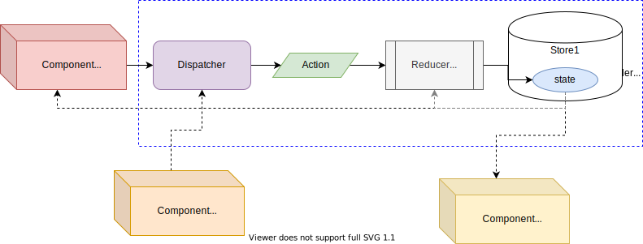

# Combining/Blending - Tagged Reducers/Mappers

## Consumption

Reducer or Mapper will never be accessible directly from `children` elements, they will be **able to access the State and/or Dispatcher**.

There are different ways of doing this:

* **`injectTaggedReducer`**, which give access both State and [`Dispatcher`](../src/react-reducer-provider.d.ts).
* **`injectTaggedReducerDispatcher`**, which give access only the [`Dispatcher`](../src/react-reducer-provider.d.ts).
* **`injectTaggedReducerState`**, which give access only the State.

or

* **`injectTaggedMapper`**, which give access both State and [`Dispatcher`](../src/react-reducer-provider.d.ts).
* **`injectTaggedMapperDispatcher`**, which give access only the [`Dispatcher`](../src/react-reducer-provider.d.ts).
* **`injectTaggedMapperState`**, which give access only the State.

or

* injectTaggedAny, which give access any tagged State and [`Dispatcher`](../src/react-reducer-provider.d.ts).
* injectTaggedAnyState, which give access any tagged [`Dispatcher`](../src/react-reducer-provider.d.ts).
* injectTaggedAnyDispatcher, which give access only any tagged State.



> When using any `injectTagged*`, ,  Be Aware that they use `React Consumer`, a Consumer component will always re-render when the context value changes, in this case when `state` changes, therefore when using `injectReducerDispatcher`/`injectMapperDispatcher` although it not depends "directly" on `state` the component will be re-render when `state` changes. Final words, use `SyncMapperProvider` and/or `AsyncMapperProvider`,`SyncReducerProvider` and/or `AsyncReducerProvider` everywhere is required and use `injectReducer`/`injectMapper`, `injectReducerDispatcher`/`injectMapperDispatcher` and/or `injectReducerState`/`injectMapperState` wisely (small scopes, as close to where is required with small amount of children).

### `injectTaggedReducer`/`injectTaggedMapper`

`injectTaggedReducer(ComponentClass, injectedPropName, tag, id)`  
`injectTaggedMapper(ComponentClass, injectedPropName, tag, id)`

*parameters*:

* `ComponentClass: class`: Component class to be enhanced with `react-reducer-provider` properties.
* `injectedPropName: string`: Desired name of the property to be injected that correspond to the reducer/mapper (Be sure to avoid collision).
* `tag: string | number | symbol`: that identifies an actions/reducer/state combination.
* `id?: string | number | symbol`: constitutes the identifier of the `*TaggedProvider` being accessed.

> :exclamation: No Error checking is done behind the scene for Tag, so "keep track" of tags (to avoid getting a `undefined` error).

*returns*:

* Enhanced Component Class with the indicated property, which holds a tuple containing the `state` as first element, and the `dispatcher` as second element.

Accessing Specific Tagged Reducer/Mapper:

```jsx
import { injectTaggedMapper } from 'react-reducer-provider'
import React from 'react'

class ClassComponentA11 extends React.Component {
  render() {
    const [ state, dispatch ] = this.props.mapper
    return (
      <button onClick={() => dispatch('ACTION1')}>
        Click{state}
      </button>
    )
  }
}
const ClassComponent11 = injectTaggedMapper(ClassComponentA11, 'mapper', 'Tag1', 497)
```

Accessing Singleton Tagged Reducer/Mapper:

```jsx
import { injectTaggedReducer } from 'react-reducer-provider'
import React from 'react'

class ClassComponentA1 extends React.Component {
  render() {
    const [ state, dispatch ] = this.props.mapper
    return (
      <button onClick={() => dispatch('ACTION1')}>
        Click{state}
      </button>
    )
  }
}
const ClassComponent11 = injectTaggedMapper(ClassComponentA11, 'mapper', 'Tag1')
```

### `injectTaggedAny`

`injectTaggedAny(ComponentClass, injectedPropName, id)`

*parameters*:

* `ComponentClass: class`: Component class to be enhanced with `react-reducer-provider` properties.
* `injectedPropName: string`: Desired name of the property to be injected (Be sure to avoid collision).
* `id?: string | number | symbol`: constitutes the identifier of the `*TaggedProvider` being accessed.

*returns*:

* Enhanced Component Class with the indicated property, which holds a tuple containing a Map of `states` as first element, and a Map of `dispatchers` as second element.

Accessing Specific Tagged Reducer/Mapper:

```jsx
import { injectTaggedAny } from 'react-reducer-provider'
import React from 'react'

class ClassComponentA1 extends React.Component {
  render() {
      const [ states, dispatchers ] = this.props.reducers
      const dispatch = dispatchers.get('Tag1')
      return (
        <button onClick={() => dispatch('ACTION1')}>
          Go up (from {states.get('Tag1')})!
        </button>
      )
  }
}
const ClassComponent11 = injectTaggedAny(ClassComponentA11, 'reducers', 'someTaggedReducerS0')
```

Accessing Singleton Tagged Reducer/Mapper:

```jsx
import { injectTaggedAny } from 'react-reducer-provider'
import React from 'react'

class ClassComponentA1 extends React.Component {
  render() {
      const [ states, dispatchers ] = this.props.reducers
      const dispatch = dispatchers.get('Tag1')
      return (
        <button onClick={() => dispatch('ACTION1')}>
          Go up (from {states.get('Tag1')})!
        </button>
      )
  }
}
const ClassComponent11 = injectTaggedAny(ClassComponentA11, 'reducers')
```

### `injectTaggedReducerDispatcher`/`injectTaggedMapperDispatcher`

`injectTaggedReducerDispatcher(ComponentClass, injectedPropName, tag, id)`  
`injectTaggedMapperDispatcher(ComponentClass, injectedPropName, tag, id)`

*parameters*:

* `ComponentClass: class`: Component class to be enhanced with `react-reducer-provider` properties.
* `injectedPropName: string`: Desired name of the property to be injected that correspond to the dispatcher (Be sure to avoid collision).
* `tag: string | number | symbol`: that identifies an actions/reducer/state combination.
* `id?: string | number | symbol`: constitutes the identifier of the `*TaggedProvider` being accessed.

> :exclamation: No Error checking is done behind the scene for Tag, so "keep track" of tags (to avoid getting a `undefined` error).

*returns*:

* Enhanced Component Class with the indicated property, which holds the `dispatcher` of the respective Reducer/Mapper Provider.

Accessing Specific Tagged Reducer/Mapper:

```jsx
import { injectTaggedReducerDispatcher } from 'react-reducer-provider'
import React from 'react'

class ClassComponentA11 extends React.Component {
  render() {
    return (
      <button id='F1' onClick={() => this.props.dispatch('ACTION1')}>
        Click1
      </button>
    )
  }
}
const ClassComponent11 = injectTaggedReducerDispatcher(ClassComponentA11, 'dispatch', 'Tag1', 'someTaggedReducerS2')
```

Accessing Singleton Tagged Reducer/Mapper:

```jsx
import { injectTaggedReducerDispatcher } from 'react-reducer-provider'
import React from 'react'

class ClassComponentA11 extends React.Component {
  render() {
    return (
      <button id='F1' onClick={() => this.props.dispatch('ACTION1')}>
        Click1
      </button>
    )
  }
}
const ClassComponent11 = injectTaggedReducerDispatcher(ClassComponentA11, 'dispatch', 'Tag1')
```

### `injectTaggedAnyDispatcher`

`injectTaggedAnyDispatcher(ComponentClass, injectedPropName, id)`

*parameters*:

* `ComponentClass: class`: Component class to be enhanced with `react-reducer-provider` properties.
* `injectedPropName: string`: Desired name of the property to be injected (Be sure to avoid collision).
* `id?: string | number | symbol`: constitutes the identifier of the `*TaggedProvider` being accessed.

*returns*:

* Enhanced Component Class with the indicated property, which holds a Map of `dispatchers`.

Accessing Specific Tagged Reducer/Mapper:

```jsx
import { injectTaggedAnyState } from 'react-reducer-provider'
import React from 'react'

class ClassComponentA12 extends React.Component {
  render() {
    const state = this.props.states.get('Tag1')
    return (
      <div>
        Child1{state}
      </div>
    )
  }
}
const ClassComponent12 = injectTaggedAnyState(ClassComponentA12, 'states', 'someTaggedReducerS6')
```

Accessing Singleton Tagged Reducer/Mapper:

```jsx
import { injectTaggedAnyState } from 'react-reducer-provider'
import React from 'react'

class ClassComponentA12 extends React.Component {
  render() {
    const state = this.props.states.get('Tag1')
    return (
      <div>
        Child1{state}
      </div>
    )
  }
}
const ClassComponent12 = injectTaggedAnyState(ClassComponentA12, 'states')
```

### `injectTaggedReducerState`/`injectTaggedMapperState`

`injectTaggedReducerState(ComponentClass, injectedPropName, tag, id)`  
`injectTaggedMapperState(ComponentClass, injectedPropName, tag, id)`

*parameters*:

* `ComponentClass: class`: Component class to be enhanced with `react-reducer-provider` properties.
* `injectedPropName: string`: Desired name of the property to be injected that correspond to the state (Be sure to avoid collision).
* `tag: string | number | symbol`: that identifies an actions/reducer/state combination.
* `id?: string | number | symbol`: constitutes the identifier of the `*TaggedProvider` being accessed.

> :exclamation: No Error checking is done behind the scene for Tag, so "keep track" of tags (to avoid getting a `undefined` error).

*returns*:

* Enhanced Component Class with the indicated property, which holds the `state` of the respective Reducer/Mapper Provider.

Accessing Specific Tagged Reducer/Mapper:

```jsx
import { injectTaggedReducerState } from 'react-reducer-provider'
import React from 'react'

class ClassComponentAN2 extends React.Component {
  render() {
    return (
      <div>
        ChildN{this.props.state}
      </div>
    )
  }
}
const ClassComponentN2 = injectTaggedReducerState(ClassComponentAN2, 'state', 'TagN', 'someTaggedReducerS6')
```

Accessing Singleton Tagged Reducer/Mapper:

```jsx
import { injectTaggedReducerState } from 'react-reducer-provider'
import React from 'react'

class ClassComponentAN2 extends React.Component {
  render() {
    return (
      <div>
        ChildN{this.props.state}
      </div>
    )
  }
}
const ClassComponentN2 = injectTaggedReducerState(ClassComponentAN2, 'state', 'TagN')
```

### `injectTaggedAnyState`

`injectTaggedAnyState(ComponentClass, injectedPropName, id)`

*parameters*:

* `ComponentClass: class`: Component class to be enhanced with `react-reducer-provider` properties.
* `injectedPropName: string`: Desired name of the property to be injected (Be sure to avoid collision).
* `id?: string | number | symbol`: constitutes the identifier of the `*TaggedProvider` being accessed.

*returns*:

* Enhanced Component Class with the indicated property, which holds a Map of `states`.

Accessing Specific Tagged Reducer/Mapper:

```jsx
import { injectTaggedAnyState } from 'react-reducer-provider'
import React from 'react'

class ClassComponentA12 extends React.Component {
  render() {
    const state = this.props.states.get('Tag1')
    return (
      <div>
        Child1{state}
      </div>
    )
  }
}
const ClassComponent12 = injectTaggedAnyState(ClassComponentA12, 'states', 'someTaggedReducerS7')
```

Accessing Singleton Tagged Reducer/Mapper:

```jsx
import { injectTaggedAnyState } from 'react-reducer-provider'
import React from 'react'

class ClassComponentA12 extends React.Component {
  render() {
    const state = this.props.states.get('Tag1')
    return (
      <div>
        Child1{state}
      </div>
    )
  }
}
const ClassComponent12 = injectTaggedAnyState(ClassComponentA12, 'states')
```

__________________

## More Documentation

* [`AsyncTaggedReducerProvider` | `SyncTaggedReducerProvider` | `AsyncTaggedMapperProvider` | `SyncTaggedMapperProvider`](blending-definition.md).
* [`useTaggedAny` | `useTaggedAnyState` | `useTaggedAnyDispatcher` | `useTaggedReducer` | `useTaggedReducerState` | `useTaggedReducerDispatcher` | `useTaggedMapper` | `useTaggedMapperState` | `useTaggedMapperDispatcher`](blending-consumption-hooks.md).
* [`AsyncReducerProvider`,`SyncReducerProvider`,`AsyncMapperProvider`&`SyncMapperProvider`](reference.md#definition).
* [`useReducer`,`useReducerState`,`useReducerDispatcher`,`useMapper`,`useMapperState`&`useMapperDispatcher`](reference.md#consumption)
* [`injectReducer` | `injectReducerState` | `injectReducerDispatcher` | `injectMapper` | `injectMapperState` | `injectMapperDispatcher`](reference-consumption-hoc.md).
* [Singleton](singleton.md).
* [Nesting Providers](nesting.md).
* [Typings](typings.md).
* [With Injection](with-injection.md).
  * [with Flow typings](with-injection-and-flow-typings.md).
  * [with Typescript typings](with-injection-and-ts-typings.md).
* [With Actions Creators](with-actions-creators.md).
  * [with Flow typings](with-actions-creators-and-flow-typings.md).
  * [with Typescript typings](with-actions-creators-and-ts-typings.md).
* [Testing](testing.md).
* [Examples from tests](../tests/js).
* [Typings' examples from tests](../tests/typings).
* [Extending/Developing](developing.md).

## Main documentation

[Back](../README.md)
