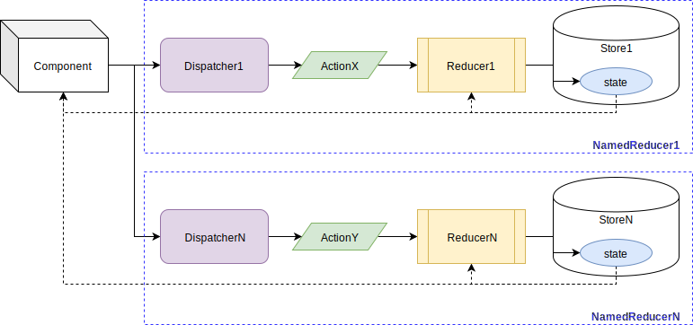

# Nesting Providers

`SyncReducerProvider` and/or `AsyncReducerProvider` can be nested in layers, in order to have several nested Reducer/State.

```jsx
<SyncReducerProvider
  id='someNamedReducer1'
  reducer={reduce1}
  initialState={initialState1}
>
  {someChildren}
  <SyncReducerProvider
    id='someNamedReducerN'
    reducer={reduceN}
    initialState={initialStateN}
  >
    {moreChildren}
  </SyncReducerProvider>
</SyncReducerProvider>
```

* `someChildren` can access the State and the Dispatcher of the `'someNamedReducer1'`.


* `moreChildren` can access the State and the Dispatcher of the `'someNamedReducer1'` plus the State and the Dispatcher of the `'someNamedReducerN'`.



e.g.:

```jsx
<SyncReducerProvider
  id='someNamedReducer1'
  reducer={reduce1}
  initialState={initialState1}
>
  <SomeComponentA />
  <SyncReducerProvider
    id='someNamedReducerN'
    reducer={reduceN}
    initialState={initialStateN}
  >
    <SomeComponentB />
  </SyncReducerProvider>
</SyncReducerProvider>
```

```jsx
export default function SomeComponentA() {
  const [ state, dispatch ] = useReducer('someNamedReducer1')
  return (
    <button onClick={() => dispatch('ACTIONA')}>
      Go up (from {state})!
    </button>
  )
}
```

```jsx
export default function SomeComponentB() {
  const [ outerState, outerDispatch ] = useReducer('someNamedReducer1')
  const [ innerState, innerDispatch ] = useReducer('someNamedReducerN')
  return (
    <div>
      <button onClick={() => outerDispatch('ACTIONA')}>
        Outer Go up (from {outerState})!
      </button>
      <button onClick={() => innerDispatch('ACTIONB')}>
        Inner Go up (from {innerState})!
      </button>
    </div>
  )
}
```

> Naming allows to identified each reducer provider.  
> Names must exists and match, if not, an Error `Uncaught [TypeError: Cannot read property 'context' of undefined]` may be throw since your are trying to access a provider that doesn't exist.  
> Although nesting can be rejected due to violation of single source of truth, In React is good to keep changes near to related components, i.e. a `SyncReducerProvider` or `AsyncReducerProvider` near to related components is better, why? because having a 1 Single Root `SyncReducerProvider` or `AsyncReducerProvider` will trigger changes to "all" components, even not related ones.  
> Examples of use can be looked at [basecode-react-ts](https://github.com/gmullerb/basecode-react-ts) and [basecode-cordova-react-ts](https://github.com/gmullerb/basecode-cordova-react-ts).  

__________________

## More Documentation

* [`AsyncReducerProvider`,`SyncReducerProvider`,`AsyncMapperProvider`&`SyncMapperProvider`](readme/reference.md#definition).
* [`useReducer`,`useReducerState`,`useReducerDispatcher`,`useMapper`,`useMapperState`&`useMapperDispatcher`](readme/reference.md#consumption)
* [Combining/Blending Reducers | Combining/Blending Mappers](readme/blending.md).
* [Typings](typings.md).
* [With Injection](with-injection.md).
  * [with Flow typings](with-injection-and-flow-typings.md).
  * [with Typescript typings](with-injection-and-ts-typings.md).
* [With Actions Creators](with-actions-creators.md).
  * [with Flow typings](with-actions-creators-and-flow-typings.md).
  * [with Typescript typings](with-actions-creators-and-ts-typings.md).
* [Testing](testing.md).
* [Examples from tests](../tests/js).
* [Online examples](readme/online.md).
* [Typings' examples from tests](../tests/typings).
* [Extending/Developing](developing.md).

## Main documentation

[Back](../README.md)
