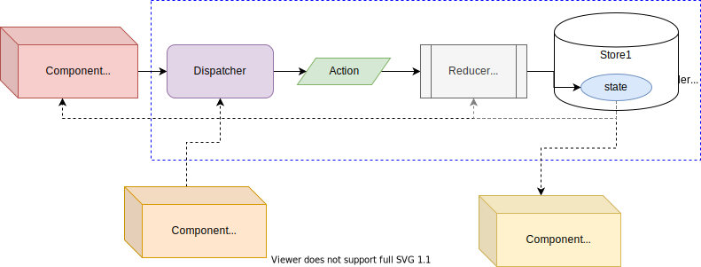

# `injectReducer` | `injectReducerState` | `injectReducerDispatcher` | `injectMapper` | `injectMapperState` | `injectMapperDispatcher`

## Consumption

Reducer or Mapper will never be accessible directly from `children` elements, they will be **able to access the State and/or Dispatcher**.

There are different ways of doing this:

* **`injectReducer`**, which give access both State and [`Dispatcher`](../src/react-reducer-provider.d.ts).
* **`injectReducerDispatcher`**, which give access only the [`Dispatcher`](../src/react-reducer-provider.d.ts).
* **`injectReducerState`**, which give access only the State.

or

* **`injectMapper`**, which give access both State and [`Dispatcher`](../src/react-reducer-provider.d.ts).
* **`injectMapperDispatcher`**, which give access only the [`Dispatcher`](../src/react-reducer-provider.d.ts).
* **`injectMapperState`**, which give access only the State.



> When using `injectReducer`/`injectMapper`, `injectReducerDispatcher`/`injectMapperDispatcher` and/or `injectReducerState`/`injectMapperState`,  Be Aware that they use `React Consumer`, a Consumer component will always re-render when the context value changes, in this case when `state` changes, therefore when using `injectReducerDispatcher`/`injectMapperDispatcher` although it not depends "directly" on `state` the component will be re-render when `state` changes. Final words, use `SyncMapperProvider` and/or `AsyncMapperProvider`,`SyncReducerProvider` and/or `AsyncReducerProvider` everywhere is required and use `injectReducer`/`injectMapper`, `injectReducerDispatcher`/`injectMapperDispatcher` and/or `injectReducerState`/`injectMapperState` wisely (small scopes, as close to where is required with small amount of children).

### `injectReducer`/`injectMapper`

`injectReducer(ComponentClass, injectedPropName, id)`  
`injectMapper(ComponentClass, injectedPropName, id)`

*parameters*:

* `ComponentClass: class`: Component class to be enhanced with `react-reducer-provider` properties.
* `injectedPropName: string`: Name of the property to be injected to the Class component that correspond to the reducer/mapper.
  * Returns a tuple containing the `state` as first element, and the `dispatcher` as second element.
  * Can be any name just be sure to avoid collision with existing names.
* `id?: string | number | symbol`: constitutes the identifier (name, number or symbol) of the `SyncReducerProvider`, `AsyncReducerProvider`,`SyncMapperProvider` or `AsyncMapperProvider` being accessed.

*returns*:

* Enhanced Component Class with the indicated property, which holds a tuple containing the `state` as first element, and the `dispatcher` as second element.

```jsx
import { injectReducer } from 'react-reducer-provider'
import React from 'react'

class SomeComponent1 extends React.Component {
  render() {
    const [ state, dispatch ] = this.props.reducer
    return (
      <button onClick={() => dispatch('ACTION1')}>
        Child{state}
      </button>
    )
  }
}
export default injectReducer(SomeComponent1, 'reducer', 'someNamedReducer')
```

### `injectReducerDispatcher`/`injectMapperDispatcher`

`injectReducerDispatcher(ComponentClass, injectedPropName, id)`  
`injectMapperDispatcher(ComponentClass, injectedPropName, id)`

*parameters*:

* `ComponentClass: class`: Component class to be enhanced with `react-reducer-provider` properties.
* `injectedPropName: string`: Name of the property to be injected to the Class component that correspond to the dispatcher.
  * Can be any name just be sure to avoid collision with existing names.
* `id ?: string | number | symbol`: constitutes the identifier (name, number or symbol) of the `SyncReducerProvider`, `AsyncReducerProvider`,`SyncMapperProvider` or `AsyncMapperProvider` being accessed.

*returns*:

* Enhanced Component Class with the indicated property, which holds the dispatcher.

```jsx
import { injectMapperDispatcher } from 'react-reducer-provider'
import React from 'react'

class ClassComponentA1 extends React.Component {
  render() {
    return (
      <button onClick={() => this.props.dispatch('ACTION1')}>
        Click
      </button>
    )
  }
}
const ClassComponent1 = injectMapperDispatcher(ClassComponentA1, 'dispatch', 557)
```

### `injectReducerState`/`injectMapperState`

`injectReducerState(ComponentClass, injectedPropName, id)`  
`injectMapperState(ComponentClass, injectedPropName, id)`

*parameters*:

* `ComponentClass: class`: Component class to be enhanced with `react-reducer-provider` properties.
* `injectedPropName: string`: Name of the property to be injected to the Class component that correspond to the state.
  * Can be any name just be sure to avoid collision with existing names.
* `id ?: string | number | symbol`: constitutes the identifier (name, number or symbol) of the `SyncReducerProvider`, `AsyncReducerProvider`,`SyncMapperProvider` or `AsyncMapperProvider` being accessed.

*returns*:

* Enhanced Component Class with the indicated property, which holds the state.

```jsx
import { injectMapperState } from 'react-reducer-provider'
import React from 'react'

class ClassComponentA2 extends React.Component {
  render() {
    return (
      <div>
        Child{this.props.state}
      </div>
    )
  }
}
const ClassComponent2 = injectMapperState(ClassComponentA2, 'state', 557)
```

> Online example can be checked on line at [gmullerb-react-reducer-provider codesandbox](https://codesandbox.io/s/gmullerb-react-reducer-provider-forked-5fngu?module=%2Fsrc%2FSomeReducerProvider.jsx):  
[](https://codesandbox.io/s/gmullerb-react-reducer-provider-forked-5fngu?module=%2Fsrc%2FSomeReducerProvider.jsx)  

### Error

When the associated Reducer Provider can not be found, i.e. the `id` trying to be used by any `react-reducer-provider` hook is not defined, the the following error may appear:

`TypeError: Cannot read property 'Consumer' of undefined thrown`  
`TypeError: Cannot read property '1' of null thrown`  
`TypeError: Cannot read property '0' of null thrown`

Check the `id` of the defined Reducer Providers, and use a valid one.

## Synchronous Consumption

### `Dispatcher`

* when accessing the Reducer Provider, the `dispatcher` will be also a synchronous function:

    `function dispatch<ACTION>(action: ACTION): void`

    e.g.:

```jsx
    class ClassComponentA1 extends React.Component {
      render() {
        return (
          <button onClick={() => this.props.dispatch('ACTION1')}>
            Click
          </button>
        )
      }
    }
    const ClassComponent1 = injectMapperDispatcher(ClassComponentA1, 'dispatch', 557)
```

## Asynchronous Consumption

### Dispatcher

* when accessing the Reducer Provider, the `dispatcher` will be also a **asynchronous** function:

    `async function dispatch<ACTION>(action: ACTION): Promise<void>`

    e.g.:

```jsx
  class ClassComponentA1 extends React.Component {
    render() {
      return (
        <button onClick={async () => this.props.dispatch().then(value => newState = value)}>
          Click
        </button>
      )
    }
  }
  const ClassComponent1 = injectReducerDispatcher(ClassComponentA1, 'dispatch', 'testNamedReducerAA9')
```

> When the `dispatch` is resolved is an indication that the state was change, but not of any required re-rendering being done.

__________________

## More Documentation

* [`AsyncReducerProvider` | `SyncReducerProvider` | `AsyncMapperProvider` | `SyncMapperProvider`](reference-defintion.md).
* [`useReducer` | `useReducerState` | `useReducerDispatcher` | `useMapper` | `useMapperState` | `useMapperDispatcher`](reference-consumption-hooks.md).
* [Singleton](singleton.md).
* [Nesting](nesting.md).
* Combining/Blending - Tagged Reducers/Mappers.
  * [`AsyncTaggedReducerProvider` | `SyncTaggedReducerProvider` | `AsyncTaggedMapperProvider` | `SyncTaggedMapperProvider`](blending-definition.md).
  * [`useTaggedAny` | `useTaggedAnyState` | `useTaggedAnyDispatcher` | `useTaggedReducer` | `useTaggedReducerState` | `useTaggedReducerDispatcher` | `useTaggedMapper` | `useTaggedMapperState` | `useTaggedMapperDispatcher`](blending-consumption-hooks.md).
  * [`injectTaggedAny` | `injectTaggedAnyState` | `injectTaggedAnyDispatcher` | `injectTaggedReducer` | `injectTaggedReducerState` | `injectTaggedReducerDispatcher` | `injectTaggedMapper` | `injectMapperReducerState` | `injectMapperdReducerDispatcher`](blending-consumption-hoc.md).
* [Typings](typings.md).
* [With Injection](with-injection.md).
  * [with Flow typings](with-injection-and-flow-typings.md).
  * [with Typescript typings](with-injection-and-ts-typings.md).
* [With Actions Creators](with-actions-creators.md).
  * [with Flow typings](with-actions-creators-and-flow-typings.md).
  * [with Typescript typings](with-actions-creators-and-ts-typings.md).
* [Testing](testing.md).
* [Examples from tests](../tests/js).
* [Online examples](readme/online.md).
* [Typings' examples from tests](../tests/typings).
* [Extending/Developing](developing.md).

## Main documentation

[Back](../README.md)
