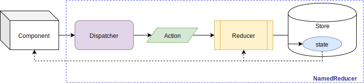

# `NamedReducer` | `useNamedReducer` | `useReducerState` | `useReducerDispatcher`

[`NamedReducer`](../src/main/js/NamedReducer.js) is a React Component which defines a [React Context](https://reactjs.org/docs/context.html) that allows to Manage State using [Flux](http://facebook.github.io/flux), an application architecture that handles application states in a unidirectional way.

* Flux is composed basically with:
  * Stores: keeps states of the app (or components).
    * Reducer: function that changes the State based on an Action and the previous State.
  * Actions: triggers changes in Store.
  * Dispatcher: sends Actions to the Store.
    * Mainly the bridge between the Store and Components.


[`NamedReducer`](../src/main/js/NamedReducer.js) is a React "Special" Element that requires 3 properties:

* `name`: constitutes the name that identifies the `NamedReducer`.
  * **must keep track of name to avoid overriding**.
* `reducer`: a function that will receive the current state and an action to produce a new state.
  * internally use [`useReducer` hook](https://reactjs.org/docs/hooks-reference.html#usereducer), which return the current state and a [dispatcher](http://facebook.github.io/flux/docs/dispatcher).
* `initialState`: inception state for the component.

```jsx
  <NamedReducer
    name='someNamedReducer'
    reducer={reduce}
    initialState={initialState}
  >
    {children}
  </NamedReducer>
```

Each `NamedReducer` is equivalent to an Flux stream:



`children` elements will be **able to access the State and Dispatcher**.  
There are different ways of doing this:

* **`useNamedReducer`**.
* **`useReducerDispatcher`**.
* **`useReducerState`**.
* Other ways: [Accessing the Context](accessing-context.md).

> Examples can be also seen at: [`NamedReducer.test.jsx`](../src/test/js/NamedReducer.test.jsx).

## Nesting

`NamedReducer` can be nested in layers, in order to have several nested Reducer/State.

```jsx
  <NamedReducer
    name='someNamedReducer1'
    reducer={reduce1}
    initialState={initialState1}
  >
    {someChildren}
    <NamedReducer
      name='someNamedReducerN'
      reducer={reduceN}
      initialState={initialStateN}
    >
      {moreChildren}
    </NamedReducer>
  </NamedReducer>
```

`moreChildren` can access the State and the Dispatcher of the NamedReducer1 plus the State and the Dispatcher of the NamedReducerN.


## Typings

**`react-named-reducer` defines typings for Flow and Typescript**:

* Any can be used without an "special" [1] configuration.
  * Typings definitions are located together with source files:
    * Flow: [`NamedReducer.js.flow`](../src/main/js/NamedReducer.js.flow).
    * Typescript: [`NamedReducer.d.ts`](../src/main/js/NamedReducer.d.ts).

Both provide the following types:

* `NamedReducer<STATE, ACTION>`: specifies the Function React Component structure.
* `NamedReducerProps<STATE, ACTION>`: defines the properties receive the `NamedReducer`.
* `NamedReducerInterface<STATE, ACTION>`: defines the type of the value return by `useNamedReducer`.
* `Dispatcher<ACTION>`: defines the function that receives the action that triggers the change of the state.

`STATE`: State type.  
`ACTION`: Action type.  

E.G.:

`SomeComponent.jsx` or `SomeComponent.tsx`:

```tsx
  const { state, dispatch } = useNamedReducer<number, string>('someNamedReducer')
```

or

```tsx
  const dispatch = useReducerDispatcher<string>('someNamedReducer')
```

or

```tsx
  const state = useReducerState<number>('someNamedReducer')
```

* A more "complete" example with Typescript can be seen at: [`typingTest.tsx`](../src/test/typings/ts/typingTest.tsx).
* A more "complete" example with Flow can be seen at: [`typingTest.jsx`](../src/test/typings/flow/typingTest.jsx).

> Initial example with Typescript typings can be checked on line: live at [gmullerb-react-named-reducer-ts demo](https://84vy7.csb.app/) and the code is at [gmullerb-react-named-reducer-ts codesandbox](https://codesandbox.io/s/gmullerb-react-named-reducer-ts-84vy7?module=%2Fsrc%2FSomeNamedReducer.tsx):  
[](https://codesandbox.io/s/gmullerb-react-named-reducer-ts-84vy7?module=%2Fsrc%2FSomeNamedReducer.tsx)  
> Initial example with Flow typings can be checked on line: live at [gmullerb-react-named-reducer-flow demo](https://9tznr.csb.app/) and the code is at [gmullerb-react-named-reducer-flow codesandbox](https://codesandbox.io/s/gmullerb-react-named-reducer-flow-9tznr?module=%2Fsrc%2FSomeNamedReducer.jsx):  
[](https://codesandbox.io/s/gmullerb-react-named-reducer-flow-9tznr?module=%2Fsrc%2FSomeNamedReducer.jsx)  
> [1] Only the usual Flow or Typescript configuration (e.g. no need for @types).

__________________

## Prerequisites

* [React Hooks](https://reactjs.org/docs/hooks-overview.html) => [`"react": "^16.8.0"`](https://www.npmjs.com/package/react).
