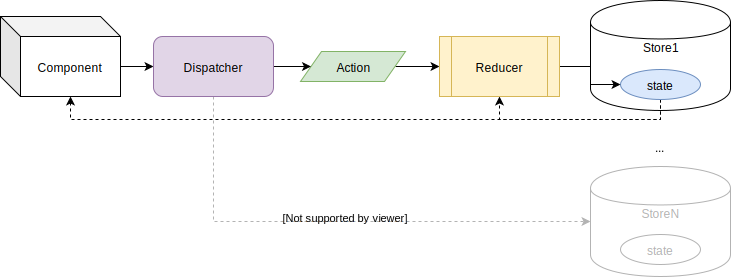

# `SyncReducerProvider` | `AsyncReducerProvider` | `useReducer` | `useReducerState` | `useReducerDispatcher`

[`SyncReducerProvider` & `AsyncReducerProvider`](../src/ReducerProvider.js) are React Components which defines a [React Context](https://reactjs.org/docs/context.html) that allows to Manage State using [Flux](http://facebook.github.io/flux), an application architecture that handles application states in a unidirectional way.

* Flux is composed basically with:
  * Stores: keeps states of the app (or components).
    * Reducer: function that changes the State based on an Action and the previous State.
  * Actions: triggers changes in Store.
  * Dispatcher: sends Actions to the Store.
    * Mainly the bridge between the Store and Components.



Each `SyncReducerProvider` or `AsyncReducerProvider` is equivalent to a Flux stream:


[`SyncReducerProvider` & `AsyncReducerProvider`](../src/ReducerProvider.js) are React "Special" Elements defined by 3 properties:

*properties*:

* `reducer`: a asynchronous/synchronous function that will receive the current state and an action to produce a new state.
* `initialState`: inception state for the component.
* `name ?: string | number` (optional): constitutes the name that identifies the `SyncReducerProvider` or `AsyncReducerProvider`, which is useful when using more than 1 provider.
  * **developer must keep track of names and numbers to avoid overriding**.
  * Internally, `SyncReducerProvider` and `AsyncReducerProvider` share the pool of names and numbers, i.e. when developing don't use the same name or number for a `SyncReducerProvider` and an `AsyncReducerProvider`.
    * `name` is used internally by a `Map`, so using numbers should be "faster" than strings.

```jsx
<SyncReducerProvider
  name='someNamedReducer'
  reducer={syncReduce}
  initialState={initialState}
>
  {children}
</SyncReducerProvider>
```

  or

```jsx
<AsyncReducerProvider
  name={12345}
  reducer={asyncReduce}
  initialState={initialState}
>
  {children}
</AsyncReducerProvider>
```

> Internally are implemented only using [`useReducer` hook](https://reactjs.org/docs/hooks-reference.html#usereducer), [`useState` hook](https://reactjs.org/docs/hooks-reference.html#usestate) and [`useCallback` hook](https://reactjs.org/docs/hooks-reference.html#usecallback).

Reducer will never be accessible directly from `children` elements, they will be **able to access the State and Dispatcher**.

There are different ways of doing this:

* **`useReducer`**, which give access both State and [`Dispatcher`](../src/react-reducer-provider.d.ts).
* **`useReducerDispatcher`**, which give access only the [`Dispatcher`](../src/react-reducer-provider.d.ts).
* **`useReducerState`**, which give access only the State.

> When using `useReducer`, `useReducerDispatcher` and/or `useReducerState`,  Be Aware that they use [`React.useContext`](https://reactjs.org/docs/hooks-reference.html#usecontext) and quote: 'A component calling useContext will always re-render when the context value changes', in this case when `state` changes, therefore when using `useReducerDispatcher` although it not depends "directly" on `state` the component will be re-render when `state` changes. Final words, use `SyncReducerProvider` and/or `AsyncReducerProvider` everywhere is required and use `useReducer`, `useReducerDispatcher` and/or `useReducerState` wisely (small scopes, as close to where is required with small amount of children). If children re-render is too expensive then `React.useMemo`:

```js
const FunComponent1 = () => {
  const dispatch = useReducerDispatcher('testNamedReducer10')
  return React.useMemo(() => (
    <RelatedChildComponent
      onClick={dispatch}
    />
  ), [dispatch])
}
```

(check test case 'should get the same dispatcher references after state changes' at [SyncReducerProvider.test.jsx](../tests/js/SyncReducerProvider.test.jsx) or [AsyncReducerProviderWithAsync.test.jsx](../tests/js/AsyncReducerProviderWithAsync.test.jsx))

[`Dispatcher`](../src/react-reducer-provider.d.ts) returns the new State or a Promise of the new State:

Synchronous dispatcher:

```js
const newState = dispatch(action)
```

Asynchronous dispatcher:

```js
dispatch(action).then(newState => console.info(newState))
```

If new State is not required, then return value can be ignored:

```js
dispatch(action)
```

> Examples can be seen at: [`SyncReducerProvider.test.jsx`](../tests/js/SyncReducerProvider.test.jsx) and [`AsyncReducerProviderWithAsync.test.jsx`](../tests/js/AsyncReducerProviderWithAsync.test.jsx).
> Examples of use can be looked at [basecode-react-ts](https://github.com/gmullerb/basecode-react-ts) and [basecode-cordova-react-ts](https://github.com/gmullerb/basecode-cordova-react-ts).  

## `useReducer`

*parameters*:

* `name ?: string | number` (optional): constitutes the name or number of the `SyncReducerProvider` or `AsyncReducerProvider` being accessed.

*returns*:

* a tuple containing the `state` as first element, and the `dispatcher` as second element.

```jsx
import { useReducer } from 'react-reducer-provider'
import React from 'react'

export default function SomeComponent1() {
  const [ state, dispatch ] = useReducer('someNamedReducer')
  return (
    <button onClick={() => dispatch('ACTION1')}>
      Go up (from {state})!
    </button>
  )
}
```

## `useReducerDispatcher`

*parameters*:

* `name ?: string | number` (optional): constitutes the name or number of the `SyncReducerProvider` or `AsyncReducerProvider` being accessed.

*returns*:

* the `dispatcher` of the respective Reducer Provider.

```jsx
import { useReducerDispatcher } from 'react-reducer-provider'
import React from 'react'

export default function SomeComponent2() {
  const dispatch = useReducerDispatcher('someNamedReducer')
  return (
    <button onClick={() => dispatch('ACTION2')}>
      Go down!
    </button>
  )
}
```

## `useReducerState`

*parameters*:

* `name ?: string | number` (optional): constitutes the name or number of the `SyncReducerProvider` or `AsyncReducerProvider` being accessed.

*returns*:

* the `state` of the respective Reducer Provider.

```jsx
import { useReducerState } from 'react-reducer-provider'
import React from 'react'

export default function SomeComponentN() {
  const currentState = useReducerState('someNamedReducer')
  return (
    <div>
      Current:{currentState}
    </div>
  )
}
```

## Synchronous Reducer => `SyncReducerProvider`

```jsx
<SyncReducerProvider
  name='someNamedReducer'
  reducer={syncReduce}
  initialState={initialState}
>
  {children}
</SyncReducerProvider>
```

* `reducer` will be a synchronous function that will receive the current state and an action to produce a new state.

    `function syncReducer<STATE, ACTION>(prevState: STATE, action: ACTION): STATE`

    e.g.:

```js
  function reduce(prevState, action) {
    switch (action) {
      case 'ACTION1':
        return prevState + 1
      case 'ACTION2':
        return prevState - 1
      default:
        return prevState
    }
  }
```

* when accessing the Reducer Provider, the `dispatcher` will be also a synchronous function:

    `function dispatch<ACTION>(action: ACTION): void`

    e.g.:

```jsx
  export default function SomeComponent2() {
    const dispatch = useReducerDispatcher('someNamedReducer')
    return (
      <button onClick={() => dispatch('ACTION2')}>
        Go down!
      </button>
    )
  }
```

## Asynchronous Reducer => `AsyncReducerProvider`

```jsx
<AsyncReducerProvider
  name='someNamedReducer'
  reducer={asyncReduce}
  initialState={initialState}
>
  {children}
</AsyncReducerProvider>
```

* `reducer` will be an **asynchronous** function that will receive the current state and an action to produce a `Promise` of the new state.

    `async function syncReducer<STATE, ACTION>(prevState: STATE, action: ACTION): Promise<STATE>`

    e.g.:

```js
  async function reduce(prevState, action) {
    switch (action) {
      case 'ACTION1':
        return await someAsyncProcess1(prevState)
      case 'ACTION2':
        return someAsyncProcess2(prevState)
      default:
        return prevState
    }
  }

```

* when accessing the Reducer Provider, the `dispatcher` will be also a **asynchronous** function:

    `async function dispatch<ACTION>(action: ACTION): Promise<void>`

    e.g.:

```jsx
  export default function SomeComponent2() {
    const dispatch = useReducerDispatcher('someNamedReducer')
    return (
      <button onClick={(async () => dispatch('ACTION2').then(someProcess())}>
        Go down!
      </button>
    )
  }
```

> When the `dispatch` is resolved is an indication that the state was change, but not of any required re-rendering being done.  
> An example can be checked on line at [gmullerb-react-reducer-provider codesandbox](https://codesandbox.io/s/gmullerb-react-reducer-provider-m0924?module=%2Fsrc%2FSomeReducerProvider.jsx):  
[](https://codesandbox.io/s/gmullerb-react-reducer-provider-m0924?module=%2Fsrc%2FSomeReducerProvider.jsx)  
> Although `AsyncReducerProvider` can be used for synchronous reducer/dispatcher (check [AsyncReducerProviderWithSync.test.jsx](tests/js/AsyncReducerProviderWithSync.test.jsx)), It is not is purpose and implementation is suitable for asynchronous processes, long story short, for synchronous processes, use `SyncReducerProvider`.  
> Examples of use can be looked at [basecode-react-ts](https://github.com/gmullerb/basecode-react-ts) and [basecode-cordova-react-ts](https://github.com/gmullerb/basecode-cordova-react-ts).  

## Singleton Reducer Provider

If no name or number is provided a "unique"[1] Reducer will be created.

> [1] This is a convention, i.e. is up to the developer not to created more Reducer Provider. Worth mentioning that no-named and named Reducer Providers can be combined.

```jsx
function SomeReducerProvider({ children }) {
  return (
    <SyncReducerProvider
      reducer={reduce}
      initialState={initialState}
    >
      {children}
    </SyncReducerProvider>
  )
}

export default SomeReducerProvider
```

When accessing the provider, the `name` is not required:

```jsx
  export default function SomeComponent1() {
    const [ state, dispatch ] = useReducer()
    return (
      <button onClick={() => dispatch('ACTION1')}>
        Go up (from {state})!
      </button>
    )
  }
```

or

```jsx
  export default function SomeComponent2() {
    const dispatch = useReducerDispatcher()
    return (
      <button onClick={() => dispatch('ACTION2')}>
        Go down!
      </button>
    )
  }
```

or

```jsx
  export default function SomeComponentN() {
    const currentState = useReducerState()
    return (
      <div>
        Current:{currentState}
      </div>
    )
  }
```

> An asynchronous example can be checked on line at [gmullerb-react-reducer-provider-async codesandbox](https://codesandbox.io/s/gmullerb-react-reducer-provider-async-oosyt?module=%2Fsrc%2FSomeReducerProvider.jsx):  
[](https://codesandbox.io/s/gmullerb-react-reducer-provider-async-oosyt?module=%2Fsrc%2FSomeReducerProvider.jsx)  
> > Examples of use can be looked at [basecode-react-ts](https://github.com/gmullerb/basecode-react-ts) and [basecode-cordova-react-ts](https://github.com/gmullerb/basecode-cordova-react-ts).  

## Nesting

`SyncReducerProvider` and/or `AsyncReducerProvider` can be nested in layers, in order to have several nested Reducer/State.

```jsx
<SyncReducerProvider
  name='someNamedReducer1'
  reducer={reduce1}
  initialState={initialState1}
>
  {someChildren}
  <SyncReducerProvider
    name='someNamedReducerN'
    reducer={reduceN}
    initialState={initialStateN}
  >
    {moreChildren}
  </SyncReducerProvider>
</SyncReducerProvider>
```

* `someChildren` can access the State and the Dispatcher of the `'someNamedReducer1'`.


* `moreChildren` can access the State and the Dispatcher of the `'someNamedReducer1'` plus the State and the Dispatcher of the `'someNamedReducerN'`.


e.g.:

```jsx
<SyncReducerProvider
  name='someNamedReducer1'
  reducer={reduce1}
  initialState={initialState1}
>
  <SomeComponentA />
  <SyncReducerProvider
    name='someNamedReducerN'
    reducer={reduceN}
    initialState={initialStateN}
  >
    <SomeComponentB />
  </SyncReducerProvider>
</SyncReducerProvider>
```

```jsx
export default function SomeComponentA() {
  const [ state, dispatch ] = useReducer('someNamedReducer1')
  return (
    <button onClick={() => dispatch('ACTIONA')}>
      Go up (from {state})!
    </button>
  )
}
```

```jsx
export default function SomeComponentB() {
  const [ outerState, outerDispatch ] = useReducer('someNamedReducer1')
  const [ innerState, innerDispatch ] = useReducer('someNamedReducerN')
  return (
    <div>
      <button onClick={() => outerDispatch('ACTIONA')}>
        Outer Go up (from {outerState})!
      </button>
      <button onClick={() => innerDispatch('ACTIONB')}>
        Inner Go up (from {innerState})!
      </button>
    </div>
  )
}
```

> Naming allows to identified each reducer provider.  
> Names must exists and match, if not, an Error `Uncaught [TypeError: Cannot read property 'context' of undefined]` may be throw since your are trying to access a provider that doesn't exist.  
> Although nesting can be rejected due to violation of single source of truth, In React is good to keep changes near to related components, i.e. a `SyncReducerProvider` or `AsyncReducerProvider` near to related components is better, why? because having a 1 Single Root `SyncReducerProvider` or `AsyncReducerProvider` will trigger changes to "all" components, even not related ones.  
> Examples of use can be looked at [basecode-react-ts](https://github.com/gmullerb/basecode-react-ts) and [basecode-cordova-react-ts](https://github.com/gmullerb/basecode-cordova-react-ts).  
__________________

## Prerequisites

* [React Hooks](https://reactjs.org/docs/hooks-overview.html) => [`"react": "^16.8.0"`](https://www.npmjs.com/package/react).

__________________

## More Documentation

* [Typings](typings.md).
* [With Injection](with-injection.md).
  * [with Flow typings](with-injection-and-flow-typings.md).
  * [with Typescript typings](with-injection-and-ts-typings.md).
* [With Actions Creators](with-actions-creators.md).
  * [with Flow typings](with-actions-creators-and-flow-typings.md).
  * [with Typescript typings](with-actions-creators-and-ts-typings.md).
* [Testing](testing.md).
* [Migration from `react-named-reducer` to `react-reducer-provider`](migration.md).
* [Extending/Developing](developing.md).

## Main documentation

[Back](../README.md)
