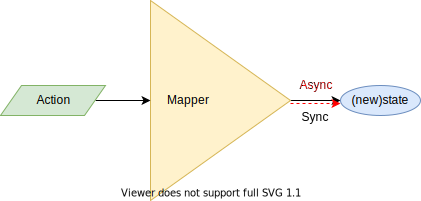
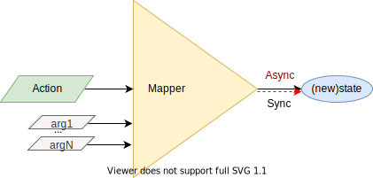

# `AsyncReducerProvider` | `SyncReducerProvider` | `useReducer` | `useReducerState` | `useReducerDispatcher` | `AsyncMapperProvider` | `SyncMapperProvider` | `useMapper` | `useMapperState` | `useMapperDispatcher`

## Definition

`SyncReducerProvider` & `AsyncReducerProvider` are React Components which defines a [React Context](https://reactjs.org/docs/context.html) that allows to Manage State using [Flux](http://facebook.github.io/flux), an application architecture that handles application states in a unidirectional way.

* Flux is composed basically with:
  * Stores: keeps states of the app (or components).
    * Reducer: function that changes the State based on an Action and the previous State.
  * Actions: triggers changes in Store.
  * Dispatcher: sends Actions to the Store.
    * Mainly the bridge between the Store and Components.


Each `SyncReducerProvider` or `AsyncReducerProvider` is equivalent to a Flux stream:


Similarly, `SyncMapperProvider` and `AsyncMapperProvider` have the following stream:


[`AsyncReducerProvider`](../src/AsyncReducerProvider.js), [`SyncReducerProvider`](../src/SyncReducerProvider.js), [`AsyncMapperProvider`](../src/AsyncMapperProvider.js) & [`SyncMapperProvider`](../src/SyncMapperProvider.js) are React "Special" Elements defined by 3 properties:

*properties*:

1 . `initialState`: inception state for the component.  
2 . `id ?: string | number | symbol`: constitutes the identifier of the `SyncReducerProvider`, `AsyncReducerProvider`, `SyncMapperProvider` or `AsyncMapperProvider`, which is useful when using more than 1 provider.

* [**Use `id` the "right" way**](keep-track-id.md).

[`AsyncReducerProvider`](../src/AsyncReducerProvider.js) & [`SyncReducerProvider`](../src/SyncReducerProvider.js) have the following property:

3 . `reducer`: a asynchronous/synchronous function that will receive the current state and an action to produce a new state [1].


`function syncReduce<STATE, ACTION>(prevState: STATE, action: ACTION): STATE`

```jsx
<SyncReducerProvider
  id='someNamedReducer'
  reducer={syncReduce}
  initialState={initialState}
>
  {children}
</SyncReducerProvider>
```

  or

`function asyncReduce<STATE, ACTION>(prevState: STATE, action: ACTION): Promise<STATE>`

```jsx
<AsyncReducerProvider
  id={12345}
  reducer={asyncReduce}
  initialState={initialState}
>
  {children}
</AsyncReducerProvider>
```

[`AsyncMapperProvider`](../src/AsyncMapperProvider.js) & [`SyncMapperProvider`](../src/SyncMapperProvider.js) have the following property:

3 . `mapper`: a asynchronous/synchronous function that will receive an action to produce a new state [1].



`function asyncMap<STATE, ACTION>(action: ACTION): Promise<STATE>`

```jsx
<AsyncMapperProvider
  id={12345}
  mapper={asyncMap}
  initialState={initialState}
>
  {children}
</AsyncMapperProvider>
```

or

`function syncMap<STATE, ACTION>(action: ACTION): STATE`

```jsx
<SyncMapperProvider
  id='someNamedMapper'
  mapper={syncMap}
  initialState={initialState}
>
  {children}
</SyncMapperProvider>
```

> [1] Internally are implemented only using [`useState` hook](https://reactjs.org/docs/hooks-reference.html#usestate) and [`useRef` hook](https://reactjs.org/docs/hooks-reference.html#useref).

## Consumption

Reducer or Mapper will never be accessible directly from `children` elements, they will be **able to access the State and/or Dispatcher**.

There are different ways of doing this:

* **`useReducer`**, which give access both State and [`Dispatcher`](../src/react-reducer-provider.d.ts).
* **`useReducerDispatcher`**, which give access only the [`Dispatcher`](../src/react-reducer-provider.d.ts).
* **`useReducerState`**, which give access only the State.

or

* **`useMapper`**, which give access both State and [`Dispatcher`](../src/react-reducer-provider.d.ts).
* **`useMapperDispatcher`**, which give access only the [`Dispatcher`](../src/react-reducer-provider.d.ts).
* **`useMapperState`**, which give access only the State.


> When using `useReducer`/`useMapper`, `useReducerDispatcher`/`useMapperDispatcher` and/or `useReducerState`/`useMapperState`,  Be Aware that they use [`React.useContext`](https://reactjs.org/docs/hooks-reference.html#usecontext) and quote: 'A component calling useContext will always re-render when the context value changes', in this case when `state` changes, therefore when using `useReducerDispatcher`/`useMapperDispatcher` although it not depends "directly" on `state` the component will be re-render when `state` changes. Final words, use `SyncMapperProvider` and/or `AsyncMapperProvider`,`SyncReducerProvider` and/or `AsyncReducerProvider` everywhere is required and use `useReducer`/`useMapper`, `useReducerDispatcher`/`useMapperDispatcher` and/or `useReducerState`/`useMapperState` wisely (small scopes, as close to where is required with small amount of children). If children re-render is too expensive then `React.useMemo`:

```jsx
const FunComponent1 = () => {
  const dispatch = useReducerDispatcher('testNamedReducer10')
  return React.useMemo(() => (
    <RelatedChildComponent
      onClick={dispatch}
    />
  ), [dispatch])
}
```

(check test case 'should get the same dispatcher references after state changes' at [SyncReducerProvider.test.jsx](../tests/js/SyncReducerProvider.test.jsx) or [AsyncReducerProviderWithAsync.test.jsx](../tests/js/AsyncReducerProviderWithAsync.test.jsx))

### Dispatcher

[`Dispatcher`](../src/react-reducer-provider.d.ts) returns the new State or a Promise of the new State:


Synchronous dispatcher:

```js
const newState = dispatch(action)
```

Asynchronous dispatcher:

```js
dispatch(action).then(newState => console.info(newState))
```

If new State is not required, then return value can be ignored:

```js
dispatch(action)
```

> Returned value is useful when using `useReducerDispatcher` or `useMapperDispatcher`.
> By default, when using typings return value is ignored, i.e is `void` or `Promise<void>`.
> Examples can be seen at: [`SyncReducerProvider.test.jsx`](../tests/js/SyncReducerProvider.test.jsx) and [`AsyncReducerProviderWithAsync.test.jsx`](../tests/js/AsyncReducerProviderWithAsync.test.jsx).
> Examples of use can be looked at [basecode-react-ts](https://github.com/gmullerb/basecode-react-ts) and [basecode-cordova-react-ts](https://github.com/gmullerb/basecode-cordova-react-ts).  

### `useReducer`/`useMapper`

*parameters*:

* `id ?: string | number | symbol`: constitutes the identifier (name, number or symbol) of the `SyncReducerProvider`, `AsyncReducerProvider`,`SyncMapperProvider` or `AsyncMapperProvider` being accessed.

*returns*:

* a tuple containing the `state` as first element, and the `dispatcher` as second element.

```jsx
import { useReducer } from 'react-reducer-provider'
import React from 'react'

export default function SomeComponent1() {
  const [ state, dispatch ] = useReducer('someNamedReducer')
  return (
    <button onClick={() => dispatch('ACTION1')}>
      Go up (from {state})!
    </button>
  )
}
```

### `useReducerDispatcher`/`useMapperDispatcher`

*parameters*:

* `id ?: string | number | symbol`: constitutes the identifier (name, number or symbol) of the `SyncReducerProvider`, `AsyncReducerProvider`,`SyncMapperProvider` or `AsyncMapperProvider` being accessed.

*returns*:

* the `dispatcher` of the respective Reducer/Mapper Provider.

```jsx
import { useReducerDispatcher } from 'react-reducer-provider'
import React from 'react'

export default function SomeComponent2() {
  const dispatch = useReducerDispatcher('someNamedReducer')
  return (
    <button onClick={() => dispatch('ACTION2')}>
      Go down!
    </button>
  )
}
```

### `useReducerState`/`useMapperState`

*parameters*:

* `id ?: string | number | symbol`: constitutes the identifier (name, number or symbol) of the `SyncReducerProvider`, `AsyncReducerProvider`,`SyncMapperProvider` or `AsyncMapperProvider` being accessed.

*returns*:

* the `state` of the respective Reducer/Mapper Provider.

```jsx
import { useReducerState } from 'react-reducer-provider'
import React from 'react'

export default function SomeComponentN() {
  const currentState = useReducerState('someNamedReducer')
  return (
    <div>
      Current:{currentState}
    </div>
  )
}
```

### Error

When the associated Reducer Provider can not be found, i.e. the `id` trying to be used by any `react-reducer-provider` hook is not defined, the the following error may appear:

`TypeError: Cannot read property '_context' of undefined`

Check the `id` of the defined Reducer Providers, and use a valid one.

## Synchronous Reducer/Mapper => `SyncReducerProvider`/`SyncMapperProvider`

### `SyncReducerProvider`

```jsx
<SyncReducerProvider
  id='someNamedReducer'
  reducer={syncReduce}
  initialState={initialState}
>
  {children}
</SyncReducerProvider>
```

* `reducer` will be a synchronous function that will receive the current state and an action to produce a new state.

    `function syncReducer<STATE, ACTION>(prevState: STATE, action: ACTION): STATE`

    e.g.:

```js
  function reduce(prevState, action) {
    switch (action) {
      case 'ACTION1':
        return prevState + 1
      case 'ACTION2':
        return prevState - 1
      default:
        return prevState
    }
  }
```

### `SyncMapperProvider`

```jsx
<SyncMapperProvider
  id='someNamedMapper'
  mapper={syncMap}
  initialState={initialState}
>
  {children}
</SyncMapperProvider>
```

* `mapper` will be a synchronous function that will receive an action to produce a new state.

    `sync function syncMapper<STATE, ACTION>(action: ACTION):STATE`

    e.g.:

```js
  async function map(action) {
    switch (action) {
      case 'ACTION1':
        return someSyncProcess1()
      case 'ACTION2':
        return someValue
      default:
        return prevState
    }
  }

```

### `Dispatcher`

* when accessing the Reducer Provider, the `dispatcher` will be also a synchronous function:

    `function dispatch<ACTION>(action: ACTION): void`

    e.g.:

```jsx
  export default function SomeComponent2() {
    const dispatch = useReducerDispatcher('someNamedReducer')
    return (
      <button onClick={() => dispatch('ACTION2')}>
        Go down!
      </button>
    )
  }
```

> An `SyncReducerProvider` example can be checked on line at [gmullerb-react-reducer-provider codesandbox](https://codesandbox.io/s/gmullerb-react-reducer-provider-qf356?module=%2Fsrc%2FSomeReducerProvider.jsx):  
[](https://codesandbox.io/s/gmullerb-react-reducer-provider-qf356?module=%2Fsrc%2FSomeReducerProvider.jsx)  
> An `SyncMapperProvider` example can be checked on line at [gmullerb-react-mapper-provider codesandbox](https://codesandbox.io/s/gmullerb-react-mapper-provider-c7hyq?module=%2Fsrc%2FSomeMapperProvider.jsx):  
[](https://codesandbox.io/s/gmullerb-react-mapper-provider-c7hyq?module=%2Fsrc%2FSomeMapperProvider.jsx)  

## Asynchronous Reducer/Mapper => `AsyncReducerProvider`/`AsyncMapperProvider`

### `AsyncReducerProvider`

```jsx
<AsyncReducerProvider
  id='someNamedReducer'
  reducer={asyncReduce}
  initialState={initialState}
>
  {children}
</AsyncReducerProvider>
```

* `reducer` will be an **asynchronous** function that will receive the current state and an action to produce a `Promise` of the new state.

    `async function asyncReducer<STATE, ACTION>(prevState: STATE, action: ACTION): Promise<STATE>`

    e.g.:

```js
  async function reduce(prevState, action) {
    switch (action) {
      case 'ACTION1':
        return await someAsyncProcess1(prevState)
      case 'ACTION2':
        return someAsyncProcess2(prevState)
      default:
        return prevState
    }
  }
```

### `AsyncMapperProvider`

```jsx
<AsyncMapperProvider
  id='someNamedMapper'
  mapper={asyncMap}
  initialState={initialState}
>
  {children}
</AsyncMapperProvider>
```

* `mapper` will be an **asynchronous** function that will receive an action to produce a `Promise` of the new state.

    `async function asyncMapper<STATE, ACTION>(action: ACTION): Promise<STATE>`

    e.g.:

```js
  async function map(action) {
    switch (action) {
      case 'ACTION1':
        return await someAsyncProcess1()
      case 'ACTION2':
        return someAsyncProcess2()
      default:
        return prevState
    }
  }
```

### Dispatcher

* when accessing the Reducer Provider, the `dispatcher` will be also a **asynchronous** function:

    `async function dispatch<ACTION>(action: ACTION): Promise<void>`

    e.g.:

```jsx
  export default function SomeComponent2() {
    const dispatch = useReducerDispatcher('someNamedReducer')
    return (
      <button onClick={(async () => dispatch('ACTION2').then(someProcess())}>
        Go down!
      </button>
    )
  }
```

> When the `dispatch` is resolved is an indication that the state was change, but not of any required re-rendering being done.  
> An `AsyncReducerProvider` can be checked on line at [gmullerb-react-reducer-provider codesandbox](https://codesandbox.io/s/gmullerb-react-reducer-provider-qf356?module=%2Fsrc%2FSomeReducerProvider.jsx):  
[](https://codesandbox.io/s/gmullerb-react-reducer-provider-qf356?module=%2Fsrc%2FSomeReducerProvider.jsx)  
> An `AsyncMapperProvider` example can be checked on line at [gmullerb-react-mapper-provider-async codesandbox](https://codesandbox.io/s/gmullerb-react-mapper-provider-async-i9iyk?module=%2Fsrc%2FSomeMapperProvider.jsx):  
[](https://codesandbox.io/s/gmullerb-react-mapper-provider-async-i9iyk?module=%2Fsrc%2FSomeMapperProvider.jsx)  
> Although `AsyncReducerProvider` can be used for synchronous reducer/dispatcher (check [AsyncReducerProviderWithSync.test.jsx](tests/js/AsyncReducerProviderWithSync.test.jsx)), It is not is purpose and implementation is suitable for asynchronous processes, long story short, for synchronous processes, use `SyncReducerProvider`.  
> Examples of use can be looked at [basecode-react-ts](https://github.com/gmullerb/basecode-react-ts) and [basecode-cordova-react-ts](https://github.com/gmullerb/basecode-cordova-react-ts).  

## Extra parameters

Dispatcher can send **any number of additional arguments**:


```jsx
  export default function SomeComponent2() {
    const dispatch = useReducerDispatcher('someNamedReducer)
    return (
      <button onClick={(async () => dispatch('ACTION2', arg1, arg2, argN).then(someProcess())}>
        Go down!
      </button>
    )
  }
```

Then, respectively:

* Reducer can have **any number of additional parameters**, and use them as pleased:


```js
  async function reduce(prevState, action, param1, param2, paramN) {
    switch (action) {
      case 'ACTION1':
        return await someAsyncProcess1(prevState, param1, param2, paramN)
      case 'ACTION2':
        return someAsyncProcess2(prevState, param1, param2, paramN)
      default:
        return prevState
    }
  }
```

* Mapper can have **any number of additional parameters**, and use them as pleased:



```js
  async function map(action, param1, param2, paramN) {
    switch (action) {
      case 'ACTION1':
        return await someAsyncProcess1(param1, param2, paramN)
      case 'ACTION2':
        return someAsyncProcess2(param1, param2, paramN)
      default:
        return prevState
    }
  }
```

> An example can be checked on line at [gmullerb-react-reducer-provider-async codesandbox](https://codesandbox.io/s/gmullerb-react-reducer-provider-async-gpst9?module=%2Fsrc%2FSomeReducerProvider.jsx):  
[](https://codesandbox.io/s/gmullerb-react-reducer-provider-async-gpst9?module=%2Fsrc%2FSomeReducerProvider.jsx)  
> This makes "obsolete" the [Action](typings.md#helpertypes), but at the end can be matter of preference.

## Singleton Reducer/Mapper Provider

If no `id` (name, number or symbol) is provided a "unique"[1] Reducer will be created.

> [1] This is a convention, i.e. is up to the developer not to created more Reducer Provider. Worth mentioning that unidentified and identified Reducer Providers can be combined.

```jsx
function SomeReducerProvider({ children }) {
  return (
    <SyncReducerProvider
      reducer={reduce}
      initialState={initialState}
    >
      {children}
    </SyncReducerProvider>
  )
}

export default SomeReducerProvider
```

When accessing the provider, the `id` is not required:

```jsx
  export default function SomeComponent1() {
    const [ state, dispatch ] = useReducer()
    return (
      <button onClick={() => dispatch('ACTION1')}>
        Go up (from {state})!
      </button>
    )
  }
```

or

```jsx
  export default function SomeComponent2() {
    const dispatch = useReducerDispatcher()
    return (
      <button onClick={() => dispatch('ACTION2')}>
        Go down!
      </button>
    )
  }
```

or

```jsx
  export default function SomeComponentN() {
    const currentState = useReducerState()
    return (
      <div>
        Current:{currentState}
      </div>
    )
  }
```

> An asynchronous example can be checked on line at [gmullerb-react-reducer-provider-async codesandbox](https://codesandbox.io/s/gmullerb-react-reducer-provider-async-m1fph?module=%2Fsrc%2FSomeReducerProvider.jsx):  
[](https://codesandbox.io/s/gmullerb-react-reducer-provider-async-m1fph?module=%2Fsrc%2FSomeReducerProvider.jsx)  
> > Examples of use can be looked at [basecode-react-ts](https://github.com/gmullerb/basecode-react-ts) and [basecode-cordova-react-ts](https://github.com/gmullerb/basecode-cordova-react-ts).  

__________________

## Prerequisites

* [React Hooks](https://reactjs.org/docs/hooks-overview.html) => [`"react": "^16.8.0"`](https://www.npmjs.com/package/react).

__________________

## More Documentation

* [Nesting](readme/nesting.md).
* [Combining/Blending Reducers](readme/blending.md).
  * [`AsyncTaggedReducerProvider`,`SyncTaggedReducerProvider`](readme/blending.md#definition).
  * [`useTaggedAny`,`useTaggedAnyState`,`useTaggedAnyDispatcher`,`useTaggedReducer`, `useTaggedReducerState`&`useTaggedReducerDispatcher`](readme/blending.md#consumption).
* [Typings](typings.md).
* [With Injection](with-injection.md).
  * [with Flow typings](with-injection-and-flow-typings.md).
  * [with Typescript typings](with-injection-and-ts-typings.md).
* [With Actions Creators](with-actions-creators.md).
  * [with Flow typings](with-actions-creators-and-flow-typings.md).
  * [with Typescript typings](with-actions-creators-and-ts-typings.md).
* [Testing](testing.md).
* [Migration from `react-named-reducer` to `react-reducer-provider`](migration.md).
* [Extending/Developing](developing.md).

## Main documentation

[Back](../README.md)
